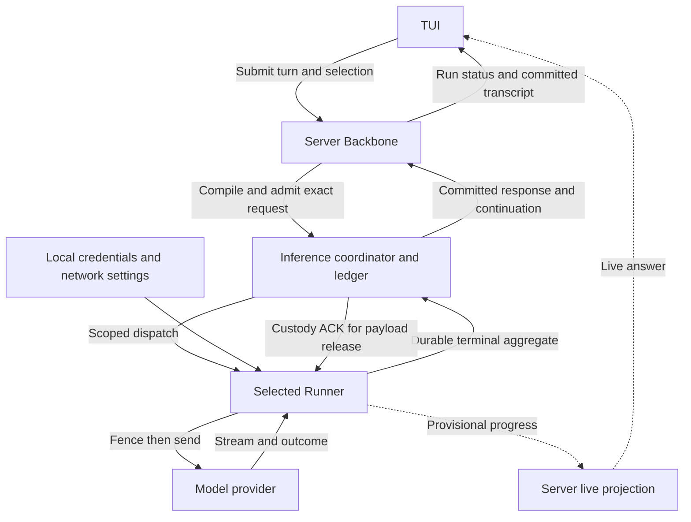

# Client surfaces and deployment

> Status: target design contract.
> Last updated: 2026-09-05.

Client surfaces and deployment owns Web, CLI, TUI, Edge process, API clients, and deployment topology boundaries. It does not own agent semantics.

## Client surfaces

| Surface | Responsibility |
| --- | --- |
| Web | Multi-device UI, streamed run projection, provider selection, task/status display. |
| CLI/TUI | Local interactive interface, local provider control, terminal permission UX. |
| Edge agent | User-owned provider process for workspace/local capabilities. |
| API clients | Programmatic access to sessions, runs, events, and provider bindings. |

All surfaces consume the same backbone state and projections.

## Deployment responsibilities

Deployment may provide:

- cloud API server;
- MatrixOne/state store;
- artifact storage;
- queue/workers;
- Edge connectivity service;
- optional managed workspace runtime;
- observability stack.

Astra runtime server does not implicitly become a Kubernetes scheduler or a local executor just because it is deployed in cloud.

## Web integration

Web integrations should use runtime contracts, not private implementation assumptions:

- session/run APIs;
- SSE or stream events;
- provider selection APIs;
- task projection;
- artifact metadata/download;
- sync/provider status;
- auth and workspace authority.

## TUI/CLI

CLI/TUI owns local interactive ergonomics but not separate agent semantics. It should expose:

- provider health;
- permission prompts;
- sync status;
- task projection;
- local diagnostics;
- reconnect/resume.

## Model Access in the TUI

> Status: accepted BYOK interaction contract; implementation is staged and not yet available.

TUI is a first-class Model Access surface. A user can discover, add, validate,
select, inspect, rotate, disable, and repair a personal model without leaving the
conversation interface. The owning execution contract is
[Runner inference and BYOK](runner-inference.md); the catalog and selection
contract belongs to [Model access and inference](model-access-and-inference.md).
These screens do not implement their own model resolver or inference lifecycle.

### BYOK experience baseline

The product promise is: configure a model account once, choose a model, and code
in the current terminal. A supported BYOK model participates in the same chat,
tools, approvals, context management, resume, and cancellation as a managed
model. Ordinary use requires no administrator model creation, manual Runner
enrollment, extra terminal, inbound port, or service installation.

The reference behaviors are API-key/environment authentication and in-session
model selection in [Claude Code authentication](https://code.claude.com/docs/en/iam)
and [model configuration](https://code.claude.com/docs/en/model-config),
environment-based startup and `/model` in the
[Pi README](https://github.com/earendil-works/pi/blob/main/packages/coding-agent/README.md),
and credential connection followed by model selection in
[OpenCode providers](https://opencode.ai/docs/providers/). Pi also documents
[custom model configuration](https://github.com/badlogic/pi-mono/blob/main/packages/coding-agent/docs/models.md).
These establish an interaction baseline; the following choices are Astra's
contract, not claims that every reference product has identical behavior or
provider coverage.

| ID | User situation | Required observable behavior |
| --- | --- | --- |
| UX-01 | First use, no model | Open a native model/connect picker. A known supported provider uses its preset; a custom service asks for protocol, endpoint, model, and optional key. Manual model entry works without a model-list endpoint. |
| UX-02 | Credentials already configured | Accept the selected model's environment or protected local credential reference without asking for the key again. Show which account/source is selected; never silently replace a saved credential with a discovered environment variable. |
| UX-03 | Interactive setup | `Test and use` runs one disclosed bounded check and selects the model. `Save without test` is available and labelled unverified. Activation and connection maintenance happen automatically. |
| UX-04 | Next launch or resume | Reuse saved configuration and remember an explicitly saved default. Resume preserves the session selection; expired credentials or an unavailable previous model produce repair, not a silent account change. |
| UX-05 | Change model | `/model` and `--model` resolve the same choices. Names remain friendly; duplicate names expose account/location. Selection preserves the conversation. Default timing and blocked-run repair follow the owning selection contract below. |
| UX-06 | Work normally | Stream text, execute permitted coding tools, manage context, and show actual model/usage through the existing workbench. Required compaction uses eligible access in the same data/billing boundary; unrelated optional services need no additional setup to begin coding. |
| UX-07 | Multiple terminals | Two terminals can use different models/keys independently. Closing one terminal does not stop the other's local model access or change its selection. |
| UX-08 | Failure or cancellation | Keep the draft and conversation. Show a specific repair for auth, endpoint, model, network, capacity, or Server failure. Esc closes a form; cancelling a turn affects that turn. Unknown delivery never becomes an automatic duplicate request. |
| UX-09 | Scripts and headless hosts | The same configured model works through existing noninteractive commands, with machine-readable output and finite failures instead of hidden prompts. No extra billable setup probe runs unless requested. |
| UX-10 | Platforms and private networks | Native Linux/macOS/Windows terminal flows, SSH, proxy/NO_PROXY, private CA, and explicit keyless endpoints use the same local transport. Missing optional keychain/daemon facilities do not force a GUI or privileged installation. |
| UX-11 | Background and enterprise use | Local execution is available while a client is attached. Continuing after all terminals close is an explicit background-service choice. An organization-provided model needs only selection; credentials are managed on its execution host. |
| UX-12 | Same work, another surface | Open the same authorized work/branch in Web or another terminal; see the same committed state and actual model/Runner. Viewing does not move execution or transfer the key. |
| UX-13 | Disconnect and durable resume | Leaving a view does not cancel work. If its local capacity goes away, retain recoverable work with an actionable wait; always-on authorized capacity continues independently. Resume reconciles results, never resends a possibly executed request. |
| UX-14 | Fork and compare approaches | Fork a committed basis with an eligible inherited model preference, then change the child's model independently. No key re-entry or paid probe when the existing configuration is usable; no copied in-flight attempt, grant, or parent cost settlement. |

An ordinary journey is `astra` → `/model` → `Add your model` → `Test and use`
→ return to the same composer. No separate page explains Runner IDs, journals,
Offerings, or publication protocols. Details remain inspectable through model
management. Astra deployment login remains required by the current Server
architecture; provider credentials do not substitute for that identity. Setup
explains once that the key stays local while context and responses pass through
the selected Astra deployment.

The technical realization, including automatic hosting and credential-source
isolation, is specified in
[Runner implementation architecture](runner-inference.md#implementation-architecture)
and [local setup implementation](runner-inference.md#local-setup-implementation).

### Entry points and selection

Extend the existing `/model` picker, `/model info` details, slash discovery, and
bottom-pane overlay framework. Add `/model add`, `/model check`, and
`/model manage` as discoverable native actions. Management exposes rotation,
disable/removal, Runner status, and eligible repair actions. The corresponding
`astra model ...` commands and TUI forms call the same setup/application service;
TUI does not spawn an interactive CLI subprocess or suspend into a second UI.

The default picker groups by Personal, Workspace, and Server-managed access,
while supporting search across groups. Each executable row carries an opaque
Offering ID and displays model, execution location, billing owner, and availability. Same
model names under different accounts remain separate choices. Name shorthand
can select only an unambiguous authorized Offering; otherwise open the picker.
Never choose whichever matching name appears first in a catalog page.

Locally detected or configured models that still need activation are typed local
candidates, labelled with their setup state. Enter routes them through local
activation and then resolves an effective Offering; a candidate reference is
never sent as an `offering_id`. Before a real session exists, an environment-backed
choice can remain a draft until submission associates its local credential with
the authenticated work scope, including eligible branches under that scope.

An illustrative wide layout is:

```text
Choose model                         Search: _

Personal
> My model    This device / devbox    Your account     Ready       Selected
  My model    Travel laptop          Your account     Offline

Workspace
  Team model  Inference Runner        Organization     Ready

Server-managed
  Cloud model Astra Server            Workspace        Ready

Add model on this device   Manage access
Up/Down navigate   Enter select or inspect   Esc back
```

Unavailable permitted rows remain focusable so Enter can show why they are
unavailable and how to repair them; Enter cannot submit them as selectable.
Distinguish `No access configured`, `No search matches`, `Runner offline`,
`Sign in required`, and `Catalog unavailable`. An error or partial catalog is
not an empty catalog. Reuse the shared complete-pagination/revision contract.
Refresh preserves focus by the stable selection target and updates its effective
Offering ID. Catalog-token or credential rotation does not jump to another row,
lose the preference, or change its data/billing boundary.

Selecting a model plus any supported thinking setting is one operation. A
cancelled thinking dialog does not partially switch the model. For an existing
session, acknowledge its preference through the shared application boundary;
before session creation, retain a local draft selection and submit it with the
first turn. Access is revalidated at admission in either case. Distinguish a
pending preference from an acknowledged preference and the actual running model.
Late responses for an old profile,
workspace, session, or catalog request cannot mutate the current view. Clearing
selection states whether the result is an explicitly governed default or no
selection; it never enables an implicit billing-changing fallback.

### Add and repair inside the conversation

`/model add` opens a bounded native form with the current Astra deployment,
account, and the local machine that will own the credential. Steps are local
configuration, secret storage, bounded connectivity/capability probe, and
publication/readiness, as defined by the Runner setup contract. Show completed,
active, failed, and not-started steps with elapsed time and a stop action. Network
waits use honest activity indicators, not invented completion percentages.

Preserve the chat draft, scroll position, and active run while the form is open.
Probe, catalog, service-control, and keychain work execute asynchronously outside
the TUI event/render loop. The shared setup operation reports typed progress;
the form projects it and cannot decide that a connection is ready from log text.
Cancel stops only this setup/probe. Before activation it preserves the prior
working configuration; after activation it reports the applied change and any
pending publication instead of pretending to undo it. Saving locally and
publishing to Server are visibly separate outcomes.

Provider keys and private endpoint values are entered only into local dedicated
form fields. Secret fields are masked, excluded from generic view `Debug`, input
history, kill/yank buffers, transcript JSONL, scrollback, telemetry, crash
diagnostics, and Server/SSE events. Do not convert a form submission into slash
command text or an assistant message. Clear secret buffers on submit/cancel;
ordinary transcript export and `/copy` cannot include them. Provider diagnostics
cross into chat only through the sanitized result type.

An enterprise Runner elsewhere is managed on its host or through its authorized
deployment/secret system. The TUI may select and diagnose its published models,
but cannot prompt for a remote key and upload it through Server. Show the actual
Runner and relevant administrator action. In an SSH terminal, `This device`
means the host running Astra/Runner, not the laptop displaying the terminal;
include that host's approved display label during setup and inspection.

### Active-run status and model changes

Keep the conversation canvas compact. The footer shows selected model and Runner
location; details show credential/billing owner and policy. Default model changes
apply to the next user turn. Keep the current turn's actual model beside its live
response and label the changed preference `Next turn`. A turn's tool/model rounds
and already-running children do not change model when another client edits the
session preference. The owning selection rules are in
[Model access and inference](model-access-and-inference.md#long-running-and-multi-agent-behavior).
Repairing a blocked current run is a separate explicit action: Server must prove
there is no active or uncertain provider attempt before acknowledging a replacement
for a future inference boundary. Purpose and inherited policy remain in force.

Status is projected from typed run/inference evidence:

| Evidence | TUI presentation and action |
| --- | --- |
| Waiting for local capacity | `Waiting for My laptop` with elapsed time; show queue information only when known. |
| Runner accepted; no model response yet | `Connecting to model` or `Waiting for model`, using the actual stage. |
| Model output arrives | Normal live answer/thinking projection; Runner is a placement detail. |
| Preview link is interrupted | `Reconnecting preview; model may still be running`; keep received text provisional. |
| Response received; durable settlement pending | `Saving response`; do not show a completed turn or execute provisional tool calls. |
| Runner offline before dispatch | Inline repair card: reconnect, choose another eligible model, or cancel. |
| Delivery outcome unknown | `Result not confirmed; checking Runner`; inspect/reconnect/cancel, with automatic retry disabled. |
| User cancellation accepted | `Stopping` until the durable run projection converges; provider usage may arrive later. |
| Durable completion | Commit the normal transcript and turn summary once, with actual placement and usage provenance available in details. |

Normal short transport stages need not flash separate labels. Keep one compact
working indicator; reveal the precise stage when waiting becomes noticeable or
details are opened. Model-response completion and whole-turn completion remain
distinct, since a completed response can request another tool/model round.

Scope the indicator to the affected run or inference branch. One child waiting
for its Runner cannot replace the primary run's status with a global error.
The existing root/agent transcript workspaces show each run's actual model and
Runner. Failure detail expands on demand; a single inline repair card updates
as evidence changes rather than appending repeated reconnect messages.

Opening/closing the picker, viewing diagnostics, or editing a draft does not
cancel a run. If an unknown attempt is unresolved, a pending model selection
does not bypass that block. The UI explains the distinction and does not offer
an apparently safe `Retry` button. Choosing another credential, billing owner,
or data boundary displays the change and applies normal policy/user authority.

### Keyboard, layout, and process lifetime

Keep existing interaction conventions: Up/Down and type-to-filter for lists,
Tab/Shift+Tab for form controls, Enter for the focused action, and Esc to return.
Unavailable choices expose explanations through keyboard focus as well as color.
Closing a details/picker overlay has no execution side effect.

An active setup/probe form owns Ctrl-C only while focused: stop that local
operation, then return to chat. Label this behavior in its footer. In the chat
context retain the existing Ctrl-C semantics for the active turn, draft, and
idle exit. OS shutdown signals follow application shutdown. Cancellation buttons
say whether they stop a probe, cancel a run, or stop a Runner; those operations
must never share an ambiguous `Stop` action.

At wide widths show a model list with selected-item detail. At narrow widths
stack the same facts and use a drill-in detail view; do not truncate away billing,
offline reasons, or execution identity. Support resizing while a secret form or
stream is active, Unicode display width, no-color themes, and terminal-safe text.
Screen-reader or non-TTY use can invoke the shared command workflow with plain
output; forms never rely on cursor animation or icons to convey state.

Leaving a TUI releases its local host attachment, not its durable work. If that
removes required capacity, explain which branches will wait and offer staying
connected or an explicit eligible background handoff. `Leave; resume later`
retains the work; `Cancel work` is a distinct action, never inferred from exit,
SSE loss, or closing a Web tab. Already selected enterprise/service capacity and
other terminals' attachments remain active. After the last local attachment,
the managed host drains bounded attempts and exits with unresolved evidence
retained. It does not promise further model/tool rounds while offline. Reentry
automatically reconnects and reconciles without requiring manual Runner startup.

### Multi-surface continuity and forks

Use the existing Work/branch navigation, status, and fork controls, not a BYOK
session browser. An authorized second view shows the same branch and actual
execution location. A laptop-backed model can be viewed from Web without making
the browser an executor; an offline laptop leaves the conversation readable and
shows the specific capacity needed to continue. Another available model is a
user choice subject to safe repair, never an automatic device migration.

Fork presents the chosen committed basis and the child's inherited model
preference. Eligible local configuration is reused through fresh child admission;
the fork action itself makes no provider call. Unavailable model access does not
prevent inspecting the fork. Changing its model affects that child, not the
parent. If the parent has an unconfirmed request, show that it remains outstanding
and is not included as a completed result. Preview text is not a fork basis.
Use existing dimension/gap reporting for workspace, artifacts, and checkpoints;
do not imply that a local workspace or secret has moved to the viewing device.
The [Runner continuity contract](runner-inference.md#continuity-across-surfaces-resume-and-fork)
owns the execution and credential inheritance rules.

## TUI runtime and performance contract

TUI owns interaction and view state. The local setup service owns credential
configuration; Runner owns local execution and custody. Server owns the admitted
selection, policy, context, and run outcome. These are authority boundaries:
hosting the same Runner runtime alongside a TUI does not move its Agent Loop.
After setup, a Runner-backed inference follows this path:



### What is local and what is authoritative

The TUI keeps a small, disposable projection:

- overlay, focus, search text, scroll position, spinner, draft text, and a
  monotonically increasing UI operation token;
- the last durable event cursor and the selected Offering ID for display;
- a bounded set of not-yet-rendered progress events.

The TUI's renderer does not resolve credentials or decide execution outcomes.
Local form submissions call the local setup service; model and run commands call
the shared Server application boundary. Secret configuration is never submitted
through the Server command path.

Read requests capture deployment, account, workspace, session, and view generation.
Apply their result only to the matching view; clear private catalog caches on
identity changes. Mutations also carry idempotency identity and an expected
selection revision. Closing an overlay cannot undo an accepted Server mutation:
after a lost acknowledgement, query its outcome and reconcile the current
selection. Ignoring an obsolete UI response is not mutation cancellation.

The target flow for `/model` is:

1. Render the picker immediately from the most recent complete snapshot, if
   one exists; otherwise render an explicit loading state and request a complete
   paginated snapshot asynchronously.
2. Keep the opaque Offering ID and definition revision in the focused row. The
   UI never turns a display name into an inference route.
3. For an existing session, send a preference command with its expected revision.
   Server validates it and returns the acknowledged preference or a typed
   conflict/repair state. Before a session exists, retain the choice as a draft.
4. Show its scope (`Next turn` or draft). Turn submission carries the selected
   Offering and thinking settings atomically; admission revalidates authority
   and reachability without requiring a live provider probe every turn.

Submitting a prompt then reuses the normal Agent Backbone. Server compiles the
exact request and records the route, invocation, and provider attempt. A
Runner receives a scoped grant, validates its local binding, materializes the
secret locally, fences the attempt in its journal, and performs provider I/O.
The TUI sees normalized progress and durable lifecycle events only. Partial
text is a preview. Server's durable response acceptance permits tool admission
and continuation. The return ACK lets Runner release its payload; Server does
not wait for ACK delivery to advance. Turn completion follows the existing run
lifecycle, and provisional usage remains labelled as such.

Changing the preference while a request is active affects the next user turn.
The active turn keeps its selection. If delivery becomes uncertain, show
`Checking result` only during bounded reconciliation, then a persistent
`Result unconfirmed` card with inspect, reconnect, cancel, and explicit new-run
actions. Explain possible prior model usage; do not spin indefinitely or offer
an ordinary retry for that attempt. Reconnect resumes from the run event
cursor and reconciles the durable projection instead of replaying local
scrollback.

### Event loop, backpressure, and rendering

Network, Server commands, catalog refresh, keychain access, probes, and Runner
diagnostics run outside the TUI render loop, with blocking OS operations kept
off its executor thread. Coalesce progress by attempt and sequence range in
bounded buffers. Reserve capacity for control and terminal events and preserve
their causal barriers. A slow TUI must not backpressure provider execution or
terminal custody. When its preview falls behind, expose the gap and reconcile
by snapshot/watermark; final facts converge from the committed aggregate.

Reuse the existing bounded subscriptions for observed root/child runs. Opening
a model picker or diagnostics does not create another run stream, poll the
database, or pause the existing subscription. Catalog search filters the
complete in-memory snapshot when
possible; a remote search is debounced and keyed by the same operation token.
Canonical history browsers remain paged. Bound new BYOK event buffers and cache
entries; reuse the existing source/width render cache and bounded live Markdown
window. Retaining the active response or local scrollback projection still
costs memory: a bounded visible window alone does not prove bounded total TUI
memory. Measure those separately, and avoid a second full response copy for BYOK.
Do not add per-token database writes or full-history redraws.

The initial implementation should measure and enforce these user-facing
targets against a stated test baseline. They are proposed acceptance criteria,
not measured results or provider SLAs:

| Budget | Contract |
| --- | --- |
| First usable frame | Show the local shell and current session without waiting for a network, catalog, or Runner call; measure cold and warm startup separately. |
| Input responsiveness | On a local PTY, key-to-visual feedback is ≤50 ms at p95 while a run or probe is active; no async operation blocks rendering. Remote terminal transport is measured separately. |
| Overlay open | Open `/model` or diagnostics from cached state within the local interaction budget; refresh and stale-state labeling happen afterward. |
| Stream rendering | Coalesce noisy progress to a bounded refresh rate and preserve sequence order; terminal/error events take priority over previews. |
| Memory | New BYOK buffers/caches have byte and count limits; report active-response, retained-history, and projection memory separately. |
| Recovery | Coalesce recovery per observed run, use bounded retries, and never append a committed response twice. |

Performance is evaluated on cold and warm startup, 40/80/120-column terminals,
large histories, high-rate streams, slow Runner links, catalog refresh during an
active run, and multiple independent sessions. The meaningful end-to-end
latencies—queue wait, grant dispatch, provider first token, preview delay, and
terminal settlement—are reported separately. BYOK adds a transport hop and is
not advertised as a latency improvement; TUI responsiveness must remain local
even when that hop or the provider is slow.

### Tradeoffs and implementation gaps

This design serves a shared Server Backbone with private model access. Even when
TUI and Runner share a machine, prompts travel Server-to-Runner and responses
travel Runner-to-Server-to-TUI. TUI attachment and Runner execution have separate
lifetimes; unattended execution needs the explicit persistent mode. An
enterprise that also needs private context must place the same Backbone inside
its boundary. Offline execution requires a separate local deployment decision.

The current CLI implementation already schedules catalog loading away from the
render loop, but it still collapses `/model` entries to names in some paths and
lets direct shorthand mutate the local session/footer immediately. Those are
implementation gaps, not a second contract: the BYOK slice must preserve the
non-blocking fetch while moving selection to Offering IDs, typed events, and
the application boundary described here before remote models are advertised.

### TUI acceptance tests

Verification uses real TUI events, fake controllable application services, and
PTY tests where terminal behavior matters. Rendering snapshots supplement
behavior assertions:

- duplicate model names resolve to the correct Offering/account; incomplete,
  stale, failed, and empty catalog responses remain distinguishable;
- browse/add/check/manage without losing a draft, blocking incoming run events,
  or interrupting an unrelated run;
- thinking-dialog cancellation is atomic; stale asynchronous results after an
  account/workspace/session switch cannot apply a selection or secret binding;
- masked entry, paste, cancel, resize, transcript export, logging, and `/copy`
  never expose the local key or private configuration;
- offline repair, unavailable keychain, cancelled probe, delayed publication,
  and Runner reuse all display the actual recoverable state;
- selection during streaming affects the next user turn; explicit blocked-run
  repair requires safe evidence, and unknown delivery never enables replacement;
- two clients changing one session preference use revision conflicts; a lost
  acknowledgement or closed overlay cannot falsely undo an accepted command;
- replay/snapshot after lost progress does not duplicate committed scrollback
  or falsely complete a response; delayed terminal usage updates attribution once;
- Ctrl-C/Esc in each context, terminal exit with an independent managed host or
  explicitly shared service,
  reconnect, and 40/80/120-column rendering preserve the stated semantics;
- two surfaces observing one branch agree on model/run state; closing either
  does not send cancel, change executor, or transfer credentials;
- fork at a committed cursor preserves the parent's preference and pending
  attempt, freshly admits the child's model, and shows unavailable-access repair
  without losing history or issuing a probe/inference just to create the fork.

## UI projection rules

- UI displays durable projection, not private local cache as truth.
- Task board is derived from task state.
- Sync state is derived from outbox/ack/degraded facts.
- Provider state is derived from provider decisions and health.
- Cancel/delete/archive must round-trip through durable state.
