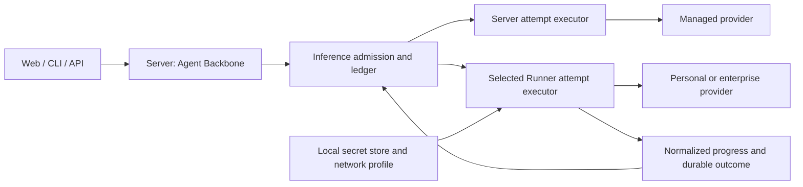

# Runner inference and BYOK

> Status: accepted for staged implementation; Runner inference is not yet available.
> Last updated: 2026-09-05.
> Parent contract: [Model access and inference](model-access-and-inference.md).
> Motivation and alternatives: [issue #702](https://github.com/matrixorigin/Astra/issues/702).

## Decision in one page

Astra should let people use their own model account or enterprise model service
without giving Astra Server the provider credential or access to that network.
BYOK describes credential ownership; Runner describes where the request executes.
They are independent: an administrator can deliberately entrust a key to a
self-hosted Server, and an enterprise Runner can use workload identity or a
keyless local model.

Keep the Agent Backbone on Server. Add inference as an independently authorized
Runner capacity, alongside tools. Server assembles context, prepares the exact
model request, admits one provider attempt, and records its outcome. The selected
Runner checks local authorization, adds local transport credentials, and performs
that request. It never decides the next model call, executes returned tool calls,
compacts context, or selects a fallback model.

The proposed choices are:

| Question | Decision | Reason |
| --- | --- | --- |
| Where is provider I/O? | On the explicitly selected Server or Runner. | Network access and credentials remain with their owner. |
| Who constructs model-visible bytes? | One shared request compiler, called by Server. | Preserve ContextPipeline, exact-wire admission, and prompt-cache behavior. |
| Is remote prepare required for every call? | No; dispatch an already compiled, immutable request. | Local secret materialization does not require a model-request round trip. |
| What prevents duplicate dispatch? | One durable Server attempt plus a Runner journal fence before I/O. | Neither WebSocket delivery nor a timeout proves execution. |
| What happens on disconnect? | Recover evidence for the same attempt; block unsafe replacement. | Avoid duplicate provider work and fabricated usage. |
| Are tools and inference tied to one Runner? | No; bind each capacity independently. | Local files may be on a laptop while inference uses an enterprise GPU Runner. |
| Does reconnect change model identity or cache namespace? | No. | Connection epochs are transport facts, not model or prompt identity. |
| What is protected? | Provider credentials and the provider network boundary. | Server still sees context and responses; private context needs a self-hosted Backbone. |

This proposal intentionally revises #702's mandatory remote prepare handshake,
connection-epoch route binding, blanket cache invalidation, and broad first-release
secret-backend scope. It retains durable admission, explicit uncertainty, tenant
isolation, a single inference ledger, and honest product guarantees.

## Ownership, goals, and non-goals

This document owns Runner inference execution: local bindings, dispatch protocol,
custody and reconciliation, streaming delivery, and their verification contract.
The parent document owns Model Access, Offerings, eligibility, routes, purposes,
usage, and billing. [Runtime lifecycle](runtime-lifecycle.md) owns run control;
[cloud-edge execution](edge-cloud-execution.md) owns Runner connection publication.
This is an inference facet of the existing provider runtime, not another agent.

Goals are personal and enterprise execution; multi-user and multi-session
isolation; cross-pod correctness; predictable first-use and recovery; and reuse
of the same Server inference path for managed and Runner-backed models.

Non-goals are browser key storage, a generic HTTP proxy, a new Agent Loop,
transparent cross-device retry, guaranteed provider billing accuracy, and
exactly-once execution at an arbitrary downstream provider. Browser-local
inference and disconnected local Agent Backbones are outside this protocol.
They must not be advertised as consequences of BYOK.

## Product invariants and minimum implementation

The starting point is Astra's durable, multi-surface Backbone, not a terminal
HTTP client. Align the ease of connecting a model with coding agents without
reducing Astra to their deployment shape. In particular:

| Product property | BYOK consequence |
| --- | --- |
| One work item across surfaces | Web and TUI observe/control the same authorized work and branch. Changing the viewer neither relocates inference nor copies credentials. |
| Durable execution | Closing a view is not cancellation. Progress, committed results, checkpoints, and unresolved attempts survive the viewer; unavailable capacity blocks only dependent execution. |
| Forkable work | Fork the canonical committed basis with a fresh child head and fresh execution authority. Model preference can be inherited; active requests, permissions, secret material, and cost settlement cannot. |
| Independent capacities | Tool and inference Runners can differ. Background continuation requires every necessary capacity, not merely an online model. |
| Ordinary coding UX | Setup once, select, work, resume, or fork. No manual Runner management or repeated paid probe in the normal journey. |

Use the existing Work/branch identity, session context coordinator, fork
coordinator, run ledger, and projections. Internal session IDs in the protocol
are resolved by those owners; BYOK does not create a second public work identity
or a new checkpoint/fork format. The detailed inheritance rules are in
[continuity and forks](#continuity-across-surfaces-resume-and-fork).

First-release scope is deliberately constrained:

| Needed for the product contract | Not a first-release prerequisite |
| --- | --- |
| Shared request adapter, existing Server admission, one Runner inference facet, durable attempt fence and terminal custody | Another Agent Loop, a general execution engine, broker, distributed transaction, or generic HTTP tunnel |
| Automatic local hosting plus explicitly managed enterprise Runner, using the same library | A general daemon supervisor, plugin/service marketplace, or automatic migration between devices |
| Environment/keyless and owner-protected file credentials on supported platforms; an explicit storage choice | Every OS keychain, Vault/KMS, provider OAuth flow, workload-identity adapter, or custom encrypted vault |
| Native model setup/selection/repair, bounded typed progress, existing Work/branch controls | Another workbench, general workflow/form engine, or separate BYOK task/status store |
| Existing cross-pod authority/recovery and one bounded progress path | A new general-purpose inter-pod streaming platform or direct Runner-to-TUI shortcut |
| OpenAI-compatible text/tools, streaming/nonstreaming, required compaction | Private body transforms, inference pools, speculative execution, or universal provider coverage |

The session-managed local host exists to preserve a stable capacity/journal and
isolate one terminal's credential attachment, not to own work. The current
implementation gives each terminal its own host identity; a future shared host
may use the same Runner library with one local endpoint and bounded attachment
state. Setup stage names below are progress projections of candidate/applied
configuration and receipts, not an invitation to build a workflow framework.
Add a new abstraction only when an existing owner cannot express a required
invariant; each new durable record needs a concrete recovery use and retention
rule. Do not delay the first complete vertical slice for speculative extensions.

The parent Model Access document also describes broader TaaS/account capabilities.
BYOK does not require implementing every one of them or rewriting unrelated
Workbench features. Extend the existing selection, policy, inference, and
Work/session owners at their actual seams; do not use this feature as a reason
to add a parallel compatibility path or a repository-wide framework refactor.

## Implementation architecture

The [BYOK experience baseline](client-surfaces-and-deployment.md#byok-experience-baseline)
defines UX-01 through UX-14 as release requirements. This section selects the
components, hosting model, and interfaces that implement them. Names introduced
below are proposed interfaces, not existing API documentation.

### Component ownership

| Component | Technical change and responsibility |
| --- | --- |
| `astra-inference-adapter` (new library) | Extract request compilation and provider decoding from `crates/runtime/src/turn/llm/client.rs`. Own immutable request bytes, declared protocol profiles, and one-request HTTP execution. Depend on shared value types, not Server services, MatrixOne, or TUI. |
| `astra-edge` library and binary | Add a library target. Extract connection, token renewal, journal primitives, and execution dispatch from the existing binary. Add an inference facet and local management API. Both the standalone binary and CLI-managed host instantiate this library. |
| `astra-credentials` | Add typed local secret references, backend resolution, and secret-safe values. Keep Astra login profiles in the existing store; provider secrets use local backends and never extend the serializable login profile with raw provider values. |
| `astra-services` | Extend `models.rs` for Runner-backed Offerings and `inference_execution.rs` for dispatch/custody facts. Keep admission, retries, usage, and continuation authority here. Session preference updates extend the session owner. |
| Server handlers in `crates/runtime/src/server/` | Extend existing model/session endpoints and `edge/edge_ws_handler.rs`. Authenticate, validate typed messages, and call services; do not duplicate resolution in HTTP versus WebSocket handlers. |
| `astra-server-types` and `astra-thin-client` | Define model-selection, public Runner publication, inference-envelope, and status wire contracts once. Private local setup/secret IPC types do not belong in these Server-facing types. |
| `astra-cli` | Add a local Model Access controller used by CLI commands, print mode, and TUI overlays. It calls local setup and shared Server APIs, and projects typed results through the existing event loop. |

The existing endpoint-based `AdmittedModelExecution` cannot represent both
executors because it carries Server-readable endpoint/auth material. Replace its
transport portion with a typed executor union: Server receives local execution
material; Runner receives only the admitted Runner binding and compiled request.
Correct endpoint calls labelled `Edge` to actual Server placement before exposing
Runner models. Extend existing entrypoints rather than keeping that endpoint path
as a BYOK compatibility branch.

### Automatic local host

Use a session-managed `astra-edge` child process by default. The installed Astra
distribution supplies the Runner executable beside the CLI; no separately
downloaded executable, privileged service, or second terminal is required. The
host runs independently of the TUI render loop; the CLI does not embed a second
inference implementation.

The current CLI-managed implementation deliberately chooses the independent
identity variant of this contract: every interactive invocation receives a
unique Edge/Runner ID and an isolated journal root. It therefore never shares
`host.lock`, an inference host, or an environment attachment with another
terminal. This is the first-release implementation of UX-07: two terminals may
use the same model configuration and environment-variable name while resolving
different provider credentials, and closing one child cannot stop the other.
The catalog publication handshake remains the readiness boundary for selecting
the local Offering; child liveness failures are surfaced with bounded captured
diagnostics before that wait begins.

An explicitly installed, long-lived service may instead use the shared-host
variant described below, but it must add attachment-scoped IPC credential
handles before it is enabled for multiple terminals. The session-managed CLI
path does not silently fall back to that shared mode.

The host scope is the authenticated Astra deployment and account under the
current OS user. Resolve it through the existing CLI profile/owner machinery,
including deployment identity; profile names and hostnames are not ownership
proof. Persistent binding and journal identities survive host restart. A boot
nonce, local discovery endpoint, and attached-client leases do not.
If multiple existing profiles resolve to this same host scope, their source
configuration identities still namespace local bindings and saved defaults.
Identical friendly names cannot overwrite another profile's applied binding.

`ensure_host(scope)` follows one algorithm for setup, normal startup, and repair:

1. Connect to the scope's owner-protected local endpoint and authenticate it.
   Reuse a compatible managed host or explicitly installed service.
2. If absent, spawn the current executable at its resolved installed path with
   the internal entrypoint and a non-secret scope reference. The child acquires
   the exclusive installation/journal lock before publishing its endpoint.
   Concurrent spawn losers exit and attach to the winner.
3. Use a bounded startup handshake to obtain host version, capabilities, boot
   nonce, and lease ID. Inspect a lock holder's typed status rather than deleting
   a lock or journal after a timeout. Incompatible peers return repair, not takeover.
4. Recover the local journal and classify outstanding attempts in bounded
   batches before advertising executable capacity. Unknown attempts retain
   fences and capacity/budget liabilities; they do not make unrelated bindings
   wait for global recovery. Acquire an independent client lease and activate
   only the requested model capacity. A corrupt shared journal blocks this host,
   not other Runners or the user's ability to open and inspect their work.

Use Unix-domain sockets in a private runtime directory on Linux/macOS and
local-only named pipes with a current-user ACL on Windows. Verify peer OS identity
and the deployment/account handshake; discovery files and socket permissions are
part of authentication. No listening TCP port or browser endpoint is introduced.
The shared host is not in a parent-death kill group tied to the first launcher.
Spawn with a controlled working directory and minimal environment; credential
and proxy material arrive through explicit local configuration, not arbitrary
inheritance from whichever terminal won the startup race. Redirect host stdio to
its own bounded diagnostic sink; it must not inherit and keep a print-mode
caller's stdout pipe open. Management progress uses IPC and cannot pollute
machine-readable command output.

Client leases are operational attachment state, not inference authorization.
IPC liveness plus heartbeats detects dead clients; initial heartbeat/expiry are
10/30 seconds. Closing one client releases only its lease and session-local
credentials. Other clients and their requests continue. When the last lease
ends, stop admitting session-managed work, drain already-started attempts within
their original deadlines, and make a bounded terminal-flush attempt. Then exit,
leaving unacknowledged payloads and replay fences recoverable on next startup.
An idle host exits after a short grace period (initially 30 seconds). It does not
run indefinitely waiting for a disconnected Server. An installed background
service has explicit independent ownership and does not use client-count exit.

Detaching a CLI is not a run-cancel command. If it removes required capacity,
show the affected work and the outcome: keep the terminal open, leave recoverable
work waiting for this device, or explicitly hand off to eligible persistent
capacity. Cancellation is a separate user action through the existing lifecycle.
A crash/expired lease disables new local starts for that attachment and
reconciles current attempts; it does not delete work or fabricate cancellation.
An already selected enterprise/service Runner continues independently of all
viewers. Persisted local keys alone do not make a session-managed host always-on,
and an environment-only key cannot silently become a service credential.

### Local management interfaces

Local management is bounded, versioned IPC, separate from the Server inference
protocol. Each mutation has an operation ID, expected binding revision, deadline,
and cancellation token. Typed operations are:

```text
AttachClient(scope, client_nonce) -> lease, host_status
ReadModelConfig(lease) -> desired_config, applied_revisions, diagnostics
StageBinding(lease, expected_revision, private_config, credential_input) -> operation
ProbeBinding(operation, explicit_probe_budget) -> progress / probe_evidence
ActivateBinding(operation, expected_revision, probe_mode) -> activation_receipt
GetOperation(operation_id) -> stage / terminal_receipt
CancelOperation(operation_id) -> cancelled / already_applied
BindClientScope(lease, binding_id, authenticated_work_scope) -> local_scope_receipt
DetachClient(lease) -> remaining_clients, affected_work
```

`BindClientScope` narrows attachment-backed credentials to a Server-verified
work scope owned by the attached principal; it does not accept caller-asserted
foreign session IDs. The ordinary scope permits its authorized same-owner
branches, delegated work, and required compaction within the same data/billing
boundary. Server derives each target and lineage from existing Work/fork owners;
fresh child admission checks that scope at the Runner fence. The fork contains
no copied grant and requires no return to the original terminal for a new key
prompt. New work outside the granted scope needs a fresh local association.
An explicitly branch-only policy remains narrower and exposes that limitation.
The scope is checked in both Offering resolution and at the Runner fence.
Configuration control cannot invoke arbitrary provider HTTP requests; probes
and admitted inference are separate operations. Read/inspect operations never
return secret values, and one attachment cannot read another's memory slot.

Shared `SetupProgress` has `operation_id`, stage, elapsed time, typed failure,
saved/applied revisions, and available actions. Only a dedicated private IPC
codec accepts secret-bearing input; generic JSON output, `Debug`, tracing, and
Server DTO serialization cannot include it. UI cancellation stops its local
operation; an activation already committed is reconciled by receipt rather than
reported as rolled back.

### Request and executor interfaces

The following schematic types capture the boundary; concrete ID types reuse
the canonical Model Access and inference ledger types:

```rust
struct CompiledInferenceRequest {
    protocol: InferenceProtocol,
    profile_revision: u64,
    body: Arc<[u8]>,
    identity: ProviderWireRequestIdentity,
}

enum AdmittedExecutor {
    Server(ServerExecutionMaterial), // Secret-safe, never serialized.
    Runner(ResolvedRunnerBinding),   // No endpoint, key, or local path.
}

// Issued only by the coordinator after exact-attempt admission.
struct AdmittedAttempt {
    plan: InferenceProviderAttemptPlan,
    request: CompiledInferenceRequest,
    executor: AdmittedExecutor,
    deadline: InferenceDeadline,
}

trait AttemptExecutor {
    async fn execute_once(
        &self,
        attempt: AdmittedAttempt,
        progress: BoundedProgressSink,
        cancellation: CancellationToken,
    ) -> AttemptEvidence;
}
```

Server and Runner transports implement the same single-attempt interface.
`AttemptEvidence` contains dispatch certainty, typed outcome, complete/partial
response reference, and usage provenance. The coordinator interprets that
evidence through the existing ledger. A raw HTTP error or a dropped future is
never itself permission to start a replacement attempt. The later protocol and
custody sections specify how Runner produces this evidence across processes.

### Server persistence and transactions

Implement schema evolution through `crates/services/src/storage.rs` and its
schema inventory. Add the following owned facts, with no parallel `byok_runs`
table or token-stream event table:

| Owner | Stored delta | Constraints and recovery access |
| --- | --- | --- |
| Runner registry | Negotiated inference facet/version and enrolled principal; connection generation remains existing presence machinery. | Reuse authenticated registry identity; no model authority from a hostname or local display label. |
| `runner_model_bindings` (new, Model Access-owned) | Public model/profile definition, opaque binding revision, allowed audience/purposes, credential-lifetime category, probe summary, active/disabled publication. Private endpoint and secret references stay local. | Unique owning-principal/Runner/binding key; revision CAS; index owning-principal/Runner/publication state. This row owns its public definition; effective Offerings are derived, not copied per session. |
| Session owner | Stable model-selection target/thinking and selection revision, resolved from an accepted effective Offering. | Preference CAS under the existing session authority lock; admitted turns capture their choice independently of later preference edits. Catalog revision tokens are not permanent preferences. |
| `inference_routes` | Immutable Runner/journal/binding/profile identities and executor kind. | Existing owner-scoped primary key; Server routes have no Runner binding. Admission creates route and invocation together. |
| `inference_provider_attempts` | Dispatch claim/lease, fixed start grant identity and expiry, request artifact reference, terminal response reference/hash, and continuation-consumption reference. | Existing unique invocation/attempt index; indexed due dispatch/reconciliation lookup scoped by owner/Runner. Scheduling keys derive from the same immutable route. |

Binding publication uses an idempotent revision command over the authenticated
Runner connection. It atomically publishes a complete public definition; partial
model lists never overwrite a complete revision. Disabling/rotation and grant
issuance share the owning authority/CAS boundary. Local application and Server
publication are not a distributed transaction: the local activation outbox
replays its exact revision and reconciles a lost receipt.

Admission, grant issuance, terminal ingestion, and continuation consumption are
short separate transactions. Never keep a SQL transaction/session lock open
across Runner or provider I/O. Terminal ingestion stores owned response custody,
outcome/usage provenance, and durable continuation work before returning its ACK.
Only the existing fenced run owner can consume continuation once. Recovery uses
bounded indexed batches in the existing inference sweeper. Session deletion
removes its binding associations and applies existing lineage-aware artifact
retention; it does not delete a model used by another session or a prefix pinned
by a fork. Explicit model removal owns shared binding deletion. Retention also
covers local loss receipts and never treats an unresolved dispatch fence as
ordinary cache cleanup.

### Continuation consumption and checkpoint fence

`runner_continuation_pending` means that an authenticated Runner transferred a
terminal response; it does **not** mean that a freshly constructed Agent Loop
may replay every pending response for the run. A multi-round run deliberately
keeps prior custody until terminal retention/acknowledgement, so an in-memory
round counter, timestamp ordering, or “latest pending” query cannot distinguish
an already projected tool round from a crash-window response.

The Agent Backbone therefore persists a typed continuation-consumption marker
only with a canonical round checkpoint. The marker is keyed by the exact
invocation/attempt terminal hash and records:

- the canonical checkpoint identity and durable sequence it extends;
- the complete logical-attempt chain for an output-cap continuation, including
  each response artifact hash and aggregate provider usage;
- the canonical response/tool-call projection hash; and
- whether the checkpoint is before tool admission, after an idempotent tool
  ledger boundary, or terminal.

Recovery restores the canonical checkpoint first, then claims only the next
unconsumed exact continuation chain. It verifies every artifact/hash and
reconstructs the same merged response and aggregate usage before entering the
ordinary post-response owner. A marker whose checkpoint is already durable is
never replayed. A terminal ACK may clear retained payload only after all of its
markers are durably accounted for; it is retention cleanup, not the sole proof
of per-round consumption.

Checkpoint publication and marker insertion use an idempotent two-phase
protocol keyed by the same immutable checkpoint identity. If publication is
visible but marker insertion was interrupted, recovery reconciles the marker
from the checkpoint; if neither is visible, custody remains unconsumed. No path
may infer consumption from a new process's zero-valued counters, a viewer
projection, or a successful tool result alone.

Local hosting implements UX-02/04/07/09/11; setup below implements UX-01/03/10;
selection and typed event projection implement UX-05/06; the shared ledger and
recovery protocol implement UX-08; the existing Work/branch, fork, and lifecycle
owners implement UX-12/13/14 with fresh Model Access admission. Release tests must
demonstrate those mappings through public commands, TUI actions, and observable
provider request counts.

## Trust and data boundary



Server knows the selected model, messages, tools, request body, output, public
capability profile, opaque binding references, and usage evidence. Runner-local
API keys, tokens, endpoint URLs, proxy authentication, private CA contents, and
workload-identity material do not enter Server APIs or durable records.
An upstream model identifier is part of the model request and may be visible to
Server; an enterprise that considers it secret needs a separately designed
adapter contract, not an undocumented local body rewrite.

The Runner accepts a narrowly scoped inference operation, never a URL, arbitrary
HTTP method, arbitrary headers, file path, shell snippet, or secret lookup chosen
by a run. Local configuration fixes provider origin, protocol operation, model
binding, and acceptable request controls. Returned tool calls are data until
Server's normal tool admission handles them.

Authentication to Astra and authentication to the provider are separate. Runner
enrollment binds deployment identity, principal or organization, allowed
workspaces, and a stable Runner identity. The private model binding adds a local
policy ceiling: approved Astra deployment, audience, models, purposes, output
limits, concurrency, and optional local spending limits. Server policy and local
policy must both allow execution. Advertising capacity cannot widen either.

Private-network inference is intentional. The local network profile permits
the configured private origin; it does not grant general private-network access.
Resolve DNS and apply redirect, proxy, TLS, and origin rules on Runner. Disable
redirects by default. Never forward authorization to a different origin. Honor
an explicit local proxy/NO_PROXY profile; validate with the same transport used
for inference. Do not silently disable TLS verification when a probe fails.

Use structured, allowlisted diagnostics across the boundary. Raw HTTP errors,
headers, URLs, provider error bodies, and debug dumps stay local and redacted.
Provider text is untrusted content; the product cannot promise to remove every
secret a malicious provider or user deliberately embeds in a response. Tests
must prove that Astra itself never copies local execution material into output.

Runner BYOK does not protect against a compromised host or unrestricted processes
running under the same OS identity. High-assurance enterprise deployments should
separate inference from shell execution with distinct processes, OS identities,
and secret permissions. An inference-only Runner needs neither a workspace mount
nor shell/file/Git capabilities. Granting inference never grants those tools.

## Model Access and binding model

### Independent identities

The parent `ResolvedInferenceRoute` carries the selected executor binding. These
identities have different lifetimes and must not be conflated:

| Identity | Meaning | Change behavior |
| --- | --- | --- |
| Runner ID | Enrolled execution principal within one Astra deployment. | Explicit enrollment/removal; never inferred from hostname. |
| Journal incarnation | Durable execution-custody identity for that Runner installation. | Survives ordinary restart; lost/reset storage creates a new incarnation. |
| Model binding ID | One locally configured inference capability. | Stable through reconnect; explicit replacement on removal/recreation. |
| Binding revision | Local endpoint, credential policy, model, or configuration revision. | New attempts re-resolve; admitted attempts cannot silently change it. |
| Serialization profile revision | Public protocol behavior, model controls, tool/thinking/cache support. | Changes exact request compilation and requires fresh admission. |
| Connection generation | Currently authenticated socket ownership. | Changes on reconnect; transports existing attempt evidence. |
| Process boot nonce | Live Runner process authorized to start a granted request. | Changes on process restart, not socket reconnect; never changes cache identity. |
| Invocation / attempt ID | Logical inference / one authorized physical request. | Transport redelivery never creates another attempt. |

`journal_incarnation` is pinned in the route because losing custody storage
invalidates duplicate suppression. Connection generation belongs in delivery
envelopes, not immutable execution identity. An inference attempt never migrates
to another Runner or journal incarnation.

The local binding contains private endpoint and credential references, a public
serialization profile, a monotonically versioned local configuration, and local
authorization limits. The advertisement contains only the public subset and an
opaque revision. Authentication and Server policy determine who can use it.

Server keeps durable binding identity and publication/disable state separately
from an expiring presence observation. Known, permitted models remain visible
offline with a reason and action. Revoked access is not exposed to an unrelated
user merely to preserve catalog history. Selection eligibility is rechecked at
each attempt, not granted for the lifetime of a session.

### Scope and capacity

A personal binding is private to its owner by default. Sharing requires explicit
publication policy; workspace membership alone does not publish a personal key.
An enterprise binding is organization-owned and offered only to approved
workspaces and inference purposes. Billing ownership is recorded independently
from the person requesting the run.

A session can use a laptop Runner for files and an enterprise Runner for a model.
Subagents and required compaction inherit the relevant data/billing boundary,
but need an eligible purpose. Optional reflection, memory extraction, or judges
cannot silently consume a personal key. A successful primary call does not prove
that a separate embedding or reranking pipeline is configured for BYOK.

Pool selection, when introduced, occurs before attempt admission and resolves to
one exact Runner. Moving to another member after an ambiguous dispatch is not
load balancing. It is a possible duplicate execution and remains blocked.

### Continuity across surfaces, resume, and fork

Viewing a work item, authorizing capacity, and owning execution are distinct.
A Web/TUI viewer can observe the same work through existing authorized projections;
it does not become the inference executor. A remote viewer may continue to use
the selected laptop binding while that binding remains authorized and online.
It cannot read its key, keep an environment attachment alive by viewing it, or
replace it with the viewer's device. Losing the only local credential attachment
leaves dependent work recoverable and waiting; an always-on Runner avoids that
availability limit. Handoff preflights inference, tools, approvals, and scope,
then uses the existing durable handoff receipt. It never reports guaranteed
continuation based on inference health alone. Changing execution location is
allowed only at the existing safe inference boundary; a handoff cannot migrate
or replace an active/unknown attempt. It can leave that attempt on its original
Runner and report the resulting wait instead of pretending migration succeeded.

Resume reopens the same authoritative work/branch and reconciles existing
invocations before another request. Durable response custody can finish a
pending transition without invoking the model again. Unknown provider execution
remains unknown even if the new UI, Runner connection, or credential is healthy.

Fork uses `DatabaseSessionForkCoordinator` and its frozen parent cursor/shared
manifest prefix, not a new BYOK snapshot. The current coordinator already excludes
run, writer lease, approval, mailbox, and invocation authority. Preserve that
separation and its explicit gaps for other state dimensions:

1. Pin the existing committed basis and create the fresh child head. Do not
   copy a live preview, provider socket, attempt/grant, local secret reference,
   journal, or pending continuation into the child.
2. Treat the parent's stable model preference as a default candidate. Resolve
   current child access, data/billing policy, purpose, and capacity before its
   first new inference. Same-owner, eligible configuration is reused without
   another key prompt or paid probe. An environment binding requires fresh child
   admission under the live attachment's authorized work scope. Missing access leaves the
   fork readable with a model-repair action, not a broken or silently rerouted fork.
3. The first explicit child turn creates new invocation/attempt identities.
   Parent results and unknown attempts remain attributed to the parent; neither
   fork creation nor restore sends provider traffic. A parent uncertainty warning
   remains visible: running new work from an earlier committed basis is not a
   retry or proof that the old request did not execute.
4. Parent and child preferences can diverge independently. They share the actual
   account/Runner concurrency and spending ceiling; a fork does not reset budgets
   or multiply quota. Existing tool admission still governs new side effects.

Preserve the existing shared-prefix fork cost: no full transcript, artifact, or
response-spool copy just to change models or create a branch. Prompt-cache reuse
is allowed only within the same model/serialization and trust/account boundary;
a new branch ID alone is not an invalidation reason. Model/profile changes
recompile through ContextPipeline and its provider-continuation rules. A local
workspace/fork manifest is not made portable merely by adding Runner inference.

## Exact request compilation and execution

### Why a single dispatch is sufficient

The existing exact-wire contract admits a hash and byte length of the serialized
provider request body before I/O. Preserve that contract. Extract the shared
request compiler and response decoder from the existing LLM client instead of
copying them into Runner.

Body-affecting behavior currently inferred from endpoint URLs must become an
explicit public serialization-profile capability. Server cannot inspect a
Runner's private URL to choose thinking fields, cache markers, or wire quirks.
The same versioned profile governs compilation and Runner validation; neither
side guesses from a model name or edits the body after admission.

Server compiles canonical messages, tool schema, thinking/output controls, and
cache intent against the admitted public serialization profile. It sends those
exact immutable bytes with their hash, protocol, model binding, and grant. Runner
validates the body and profile, resolves local execution material, and sends the
same body. Adding Authorization, endpoint selection, proxy/TLS settings, or
signing a request locally does not require rewriting the model-visible body.

This yields two durable boundaries with one application-level dispatch:

1. Server commits the exact attempt and its dispatch obligation.
2. Runner syncs the execution fence before opening the provider request.

Neither acknowledgement has to make a separate round trip before provider I/O.
There is no distributed transaction between the stores; replay and reconciliation
bridge them. Ordinary capacity rejection is cheap and proves no execution.

Adapters that need a private value inside the request body, local attachments,
or a locally chosen body transform cannot use this contract by pretending the
hash is unchanged. They are unsupported in the first release. A later explicit
prepare facet may admit locally compiled bytes, if that requirement justifies
its extra round trip and privacy/lineage contract.

The alternatives have different costs:

| Alternative | Assessment |
| --- | --- |
| Upload a personal key to Server | Valid only as an explicit Server-managed trust choice; does not solve local key custody or private-network reachability. |
| Browser performs provider calls | Ties execution to a tab, browser networking, and browser secret custody; unsuitable for durable enterprise/background work. |
| Runner is a generic HTTP tunnel | Hides endpoint/auth policy and makes the capability unnecessarily broad. |
| Runner compiles every request, then asks Server to authorize its hash | Supports private body transforms, but adds a round trip, prepared-state expiry, and another ambiguity boundary to every call. Defer until such an adapter is needed. |
| Runner runs the Agent Loop | Moves context and lifecycle authority; does not solve this feature within the shared Server Backbone. |

### Shared seams

The intended dependency direction is:

```text
Agent Loop / auxiliary inference
  -> shared inference coordinator (policy, retry, budget, deadline, ledger)
     -> shared request compiler (canonical input -> immutable body + identity)
     -> exact-attempt executor (Server or Runner transport)
        -> shared provider decoder (wire -> typed progress + outcome)
  -> canonical continuation / tool admission
```

Use a small inference adapter crate below Server services and the Runner binary.
It must not depend on the Agent Loop, MatrixOne, run routing, or CLI UI. Move
existing compiler/decoder code into it and delete the superseded copies.
Provider-specific body construction remains in that one implementation.

The executor interface consumes an opaque admitted attempt and exact body, a
bounded event sink, and a cancellation signal. It produces typed delivery and
outcome evidence. It performs at most one provider request. Hidden HTTP retries,
SDK retries, and automatic auth-error resend are prohibited. Identity-token
refresh without model execution is local; resending inference requires a new
Server-admitted attempt.

The coordinator owns retries, route changes, total budget, run-control checks,
and terminal convergence for both executors. Protocol decoders report errors;
they do not retry. Existing nonstreaming completion, compaction, and delegated
call sites must use the same seam. Streaming vs nonstreaming is a request/response
mode, not a second lifecycle.

## Dispatch, custody, and reconciliation

### Normal path

1. Resolve selection and revalidate principal, purpose, run/session/Harness
   authority, revisions, local-policy advertisement, and current Runner presence.
2. Reserve tenant/session/binding capacity and a bounded result-custody budget.
   Compile and size-check the exact request. No provider connection opens yet.
3. In the existing inference admission transaction, commit the immutable route,
   invocation, exact attempt, provider canonical transition, and Runner dispatch
   obligation. An ambiguous commit is reconciled by exact identity before send.
4. The socket-owner pod claims delivery and verifies current control and binding
   authority. Grant creation serializes with run closure/revocation in the
   existing durable authority transaction. It sends that bounded start grant
   to the admitted Runner incarnation.
5. Runner checks scope, local policy, revisions, body hash, deadline, local
   capacity, secret availability, and journal health. A rejection is typed and
   cannot have performed inference.
6. Under the local attempt lock, persist and sync `execution_fenced` with the
   exact identity/hash. Only then allow one local executor to open provider I/O.
7. Stream normalized progress. On completion/interruption, persist the terminal
   aggregate and its response reference locally, then offer it to Server.
8. Server validates evidence against the admitted attempt and durably commits
   response custody, terminal/usage facts, and a continuation obligation.
   It then acknowledges receipt. Only a current run owner may advance the loop.
9. Runner releases retained payload after the acknowledgement. Duplicate
   suppression survives payload deletion for the grant replay horizon.

Local validation and fence creation serialize with binding disable/rotation and
pin one execution-material generation. An unknown commit/sync result never opens
provider I/O speculatively. Delivery replay reuses the same start validity;
expired delivery is reconciled instead of receiving a fresh execution grant for
an uncertain attempt.

Runner acceptance or `dispatch_started` is evidence, not permission for a second
attempt. The pre-I/O journal fence is deliberately conservative: a crash after
the fence but before the request leaves the machine may still be unknown.

### Small state model

Keep Server control, delivery evidence, and provider outcome separate without
creating freely combinable state enums:

| Fact | Allowed meaning |
| --- | --- |
| Attempt admission | One immutable request/route; authorization may be active, revoked, or expired. |
| Delivery evidence | Not dispatched, may have dispatched, or provider acknowledged. |
| Outcome | Success, known failure, or no authoritative provider outcome yet. |
| Reconciliation | Pending, resolved with evidence, or action required. |
| Run control | Existing run lifecycle; cancellation does not imply the provider performed no work. |

Transitions are implemented by the existing inference ledger. A transport queue
has custody/delivery bookkeeping only. Runner's journal has
`execution_fenced -> terminal_awaiting_ack -> acknowledged tombstone`; a
pre-dispatch rejection/cancel also records a tombstone when a grant could replay.
It is an execution inbox/outbox, not a second invocation ledger.

Only one provider terminal payload is accepted for an attempt; identical hashes
are idempotent, conflicting hashes are quarantined. `DeliveryUnknown` records
what Astra knows at the time, not proof of provider failure. Late evidence is
appended and reconciled under the same attempt. It must not overwrite a terminal
run, double-settle usage, or trigger tools after cancellation.

### Loss, retry, and late evidence

A missing Runner record alone is not proof of no dispatch: storage may be reset,
an old grant may still arrive, or an earlier executor may remain alive.
Safe retry requires either a Server proof that no grant could escape, or an
authenticated, synced Runner rejection/cancellation tombstone under the same
journal incarnation which fences all valid deliveries. Journal loss, restore
from an old backup, or ambiguous filesystem sync yields `DeliveryUnknown`.

A start grant also targets the authenticated live process boot nonce. Reconnecting
the same process may replay it; restarting the process cannot. Startup classifies
outstanding Server attempts with bounded recovery before accepting fresh grants
for recovered capacity; it does not wait for every unknown outcome to resolve.
A missing old record remains unknown, and the new process cannot make it
executable by requesting a new delivery generation. Only an attempt proven never
granted may obtain its first start grant after restart. Recovery of stored results remains independent
of boot nonce, so old results can still be acknowledged.

Exactly one process holds the local journal lock. A copied installation must be
reenrolled with a new identity; shared/cloned journals are not a supported HA
mechanism. Old incarnations cannot accept fresh dispatch. Existing uncertain
attempts cannot be reassigned to the new incarnation by calling it a reconnect.

If an HTTP request may have reached the provider, timeout, TCP closure, Runner
disconnect, missing usage, and Server owner-lease expiry do not authorize a new
attempt. Reconcile via the original Runner or a documented provider lookup/
idempotency contract. A 5xx alone does not prove no provider work. Known 429/auth
rejections can be retried only under the adapter's declared retry evidence.

Provider idempotency is capability-specific, including payload equality, key
scope, account, and retention window. Use a stable operation key only across
equivalent requests covered by that contract; do not blindly reuse an invocation
ID across fallback models or changed bodies. Default adapters claim no such
guarantee. V1 never automatically replaces an ambiguously dispatched attempt.
An unresolved attempt releases caller waits and session locks. Provider capacity
remains charged while the original request may still be running, until evidence
or its original bounded execution deadline permits release. Unknown usage/budget
liability remains and blocks automatic continuation of the dependent branch. The user
can inspect, reconnect, or cancel; starting separate work is an explicit new run.

Equivalent safe retries stay within the invocation's immutable route. If fresh
resolution changes that route, use the parent's linked-invocation contract;
keep one logical operation budget and explicit lineage. Route changes do not
reset retry counts, deadline, or unresolved cost liability.

After Server failover, the new inference owner reconciles the existing admitted
attempt. The transport authenticates Runner and immutable attempt binding;
accepting evidence does not require the dead Server owner's token or socket
generation to remain live. Ingestion may store valid evidence for a cancelled
run without giving an old owner permission to advance that run.

Extend the existing inference settlement sweeper accordingly. It must not
interpret owner expiry as authorization to replace remote work, nor discard
late Runner terminals merely because the local caller already returned unknown.

### Cancellation, revocation, and deadlines

One coordinator owns an absolute provider-work deadline. Start validity is a
shorter bounded grant; reconnect never extends it. Runner uses a conservative
local monotonic deadline derived from authenticated clock/RTT negotiation and
the remaining Server budget. Clock uncertainty beyond the negotiated bound
rejects new work. Process restart never resets an expired grant's lifetime.
Transport connection/idle limits are subordinate to this budget, not competing
independent invocation timers.

Cancel before a Runner fence must serialize with fence creation and persist a
tombstone before reporting `NotDispatched`. Cancel after a fence stops local
transport where possible; it does not assert no provider execution or zero cost.
If completion wins the race, preserve real usage and the cancelled run state.

Disabling an Offering prevents new grants. A previously issued grant has a finite
validity window; instantaneous revocation across a partition cannot be promised.
Local disable takes effect before any new local fence. Emergency remote revoke
sends cancellation and denies further work; active provider cancellation is
best effort unless the provider offers a stronger contract. Show this boundary.

## Wire protocol and bounded streaming

Add a versioned inference facet to the existing authenticated Runner connection.
Do not encode inference in `ToolRequest.args` or tool results. Negotiate support
before advertising an Offering as selectable. An older peer reports
`InferenceUnsupported`; no fallback to Server HTTP or generic shell is allowed.

The minimal message families are:

| Direction | Message | Meaning |
| --- | --- | --- |
| Runner to Server | `inference_binding_publish` | Operation ID, expected publication revision, and one complete public binding definition or explicit disable action; no private configuration. |
| Server to Runner | `inference_binding_ack` | Idempotent publication receipt or typed revision/policy rejection; effective Offering selection still comes from the shared catalog. |
| Server to Runner | `inference_dispatch` | Exact attempt grant plus immutable body/reference. |
| Server to Runner | `inference_cancel` | Fence future start or cancel this exact attempt. |
| Server to Runner | `inference_progress_ack` | Flow-control watermark, with replay position if needed. |
| Server to Runner | `inference_terminal_ack` | Durable result custody for this terminal hash. |
| Server to Runner | `inference_reconcile` | Query or close uncertainty for admitted attempts. |
| Runner to Server | `inference_status` | Accepted, rejected, running, or reconciliation evidence. |
| Runner to Server | `inference_progress` | Sequenced normalized event batch. |
| Runner to Server | `inference_terminal` | Outcome, full/partial response, usage evidence, and hash. |

Execution envelopes carry deployment/principal scope, invocation/attempt ID,
Runner/journal/binding identity, exact body identity, protocol/profile version,
delivery generation, process boot nonce for start, grant expiration, and limits. Server derives ownership from
authentication and admission; payload identity is validated, not trusted.
Cancel/ACK never operate on a request ID without its owner and attempt binding.

Binding-publication messages use binding/operation identity instead of fabricated
invocation IDs. The local host is the sole publisher of its bindings; concurrent
setup operations serialize their revisions there. Publishing one binding never
replaces the complete inventory or enables an unrelated client attachment.

Progress has contiguous sequence numbers and a bounded replay ring. Identical
duplicate batches are ignored; conflicting duplicates are protocol violations.
A gap requests replay. If a ring segment has expired, use a numbered canonical
snapshot plus its watermark, then continue deltas. Do not append a replayed
snapshot to existing UI text or declare a gap-corrupted answer complete.

Progress is provisional. The canonical final response is a separate aggregate
including text, admitted opaque provider continuation blocks, thinking/tool-call
structure, finish reason, usage provenance, and completeness. Visible thinking
follows the existing exposure policy. Unknown protocol blobs do not become
headers, local paths, credentials, or execution authority.

No tools or speculative next inference start from partial streamed tool calls.
Server validates the terminal aggregate and applies the existing canonical
transition before continuation. Tool execution retains its own admission and
idempotency contract.

### ACK and custody

`progress_ack` permits disposal of replay deltas, not of the aggregate response.
Runner retains owner-protected response custody until `terminal_ack`, or until an
explicit retention-expiry action records loss of payload with retained evidence.
ACK requires durable attempt outcome, usage status, and an owned response artifact
plus durable continuation work. It need not wait for future tools or an entire
turn to complete. The continuation worker is fenced and idempotent; a cancelled
run records the response without resuming.

Server can continue after that durable commit; delivery of the return ACK to
Runner is not a continuation barrier. ACK loss prolongs Runner retention and
causes receipt replay, without adding another network round trip to the loop.
Live previews follow the progress path before terminal commit. Slow/disconnected
viewers cannot block result custody or another viewer's progress.

This distinction closes the crash window between recording token counts and
recording the actual model answer. A metrics row or response hash without payload
custody is not enough to ACK. Duplicate terminal after lost ACK returns the same
receipt. Conflict handling never silently chooses the last writer.

An already running provider stream may continue during Runner-to-Server loss
within its original deadline and reserved spool capacity. Reconnect replays
evidence; it does not reopen provider transport. Runner process crash cannot
resume a provider socket: preserve durable partial content and mark the unknown
tail. Response exhaustion cancels reading and records a partial/unknown result;
it must not silently truncate and claim success.

Checkpoint partial output in bounded owner-protected append batches with grouped local
sync, rather than syncing every token. A live progress ACK is not a partial-
durability claim. On crash, recovery reports the last synced response watermark
and an unknown tail. Terminal publication requires a complete synced aggregate
or an explicitly partial result; previewed but unsynced bytes are never invented.

### Resource budgets

Negotiate limits before dispatch and reserve enough custody for the accepted
output bound. The following are initial defaults to validate, not measurements:

| Resource | Initial bound / policy |
| --- | --- |
| Grant start window | At most 15 seconds; also bounded by inference deadline. |
| Transport frame | 256 KiB after decompression; strict collection/string limits. |
| Progress batch | Send first visible delta promptly; batch subsequent progress at 32 KiB or 50 ms, whichever comes first. Control/terminal evidence bypasses the timer. |
| Replay memory | 1 MiB per attempt, additionally capped per Runner and pod. |
| Request / response artifact | 16 MiB request and 16 MiB response per attempt by default; admit explicit larger profiles only with capacity. |
| Local response spool | 256 MiB personal default; aggregate reservation, owner-protected, bounded by local quota and retention. Additional encryption follows deployment policy. |
| Unacknowledged response retention | 24 hours default; visible expiry, no silent successful settlement. |
| Personal provider concurrency | 2 active attempts default, bounded fair queue; enterprise value is local policy. |

Large bodies/results use owner-scoped Astra artifact handles and bounded chunk
transfer; never a Runner-supplied fetch URL or an unbounded WebSocket payload.
Artifact references bind content hash, scope, and length. Deduplication is scoped
to the owner; a hash from another tenant is not authority to fetch its data.

Cancellation, heartbeat, terminal delivery, and reconciliation have reserved
channel capacity and priority over progress. Per-attempt flow control prevents
one slow inference from blocking tool results or another session's cancellation.
No database/vault await runs inside the socket reader's message-dispatch arm.

## Multiple Server pods and multiple users

The socket-owner pod and run-owner pod may differ. An attempt is owned by durable
inference authority, not by either pod's in-memory connection map.

Use the existing registry's authenticated generation-fenced connection ownership.
Dispatch obligations are derived from admitted Runner attempts and claimed by
socket owners with bounded leases. Extend the common delivery mechanics where
appropriate, but do not create fake tool invocations or agent mailbox messages.
Terminal evidence is ingested into the inference ledger by any authorized socket
owner. A run-owner wakeup is an optimization; a shared batch sweeper can recover
the committed continuation if that notification is lost.

Live progress uses bounded same-pod channels and the existing authenticated
run-event delivery path where it supports cross-pod progress. If a missing hop
requires an internal relay, implement only a typed attempt-progress facet, not a
new messaging platform. Peer destinations come from trusted deployment membership;
authorization checks the attempt owner and current observer generation. No
user-supplied pod endpoint or external message broker is required. Test the actual
socket/run/viewer placement rather than assuming sticky routing. If the progress
path is unavailable, show delayed/reconnecting preview and converge from the
durable terminal; do not retry provider execution. Normal cross-pod preview must
pass the latency gate; failure fallback is not a substitute for that happy path.

Do not use per-token database writes or a database polling loop per invocation.
Batch control/terminal work and use existing wakeup/shared polling patterns.
Request canonical WAL remains incremental; forwarding a large model request must
not reintroduce full-history JSON into every new audit row.

Capacity has three layers: shared tenant/billing admission, per-session fairness,
and Runner-local provider/spool capacity. Server admission cannot exceed the
local ceiling. Queues have length and time limits, and waiting releases unrelated
session locks. A failed personal device does not hold a global semaphore or stop
other users. Provider connection pools are scoped by local origin, authentication,
proxy/TLS policy, and credential generation; they never cross owner boundaries.

## Prompt cache and ContextPipeline

Runner inference changes the transport location, not context ownership. Server
continues to select context, compact, preserve provider continuation tokens, and
compile the provider request. Runner cannot reorder messages, add system text,
change tools, or opportunistically choose another model.

Use separate identities for separate purposes:

| Identity | Contains | Does not contain |
| --- | --- | --- |
| Attempt identity | Exact body hash, route, binding revision, admitted authority. | Reinterpreted current catalog state. |
| Cache compatibility namespace | Actual model/protocol, stable serialization semantics, trust/account isolation, opaque provider cache scope. | Invocation ID, connection generation, health timestamp, heartbeat, journal replay sequence. |
| Transport ownership | Socket generation and delivery lease. | Model selection or context authority. |

A key rotation changes credential revision. It changes cache isolation only when
the account/security scope changes or the provider requires it. Default to a new
opaque cache scope when equivalence cannot be established, without hashing raw
secrets into identifiers. A reconnect or a new capability probe timestamp alone
must not invalidate a compatible prompt prefix. A real template/tool/model change
does. Safety and exact-byte admission remain per attempt even on cache hits.

Do not promise lower latency or lower Server bandwidth merely from Runner BYOK.
Prompts still travel Server-to-Runner; streams still return to Server. It adds a
network hop while removing Server-to-provider egress and key custody. Measure
time to first token, large-context transfer, and cache hit behavior. Content-
addressed request reuse may optimize transfer later, but a cache miss must fetch
the exact admitted request without changing inference semantics.

For a TUI colocated with Runner, the physical response path is still
`provider -> Runner -> Server -> TUI`. Compare the two executors after the common
context/admission work: Runner adds exact-request transfer, local validation and
journal sync, Runner-to-provider connection/compute, and return progress through
Server. The Server path instead pays Server-to-provider connection/compute.
Which is faster depends on both network paths and request size. Provider prompt
cache hits can reduce prefill/cost but do not remove full request transfer to
Runner or repeated tool/model round trips.

Keep enrollment, configuration, and billable probes off the per-inference path.
Reuse authenticated Runner connections and locally scoped provider connection
pools; shared revision-keyed metadata accelerates revalidation without bypassing
authority. Measure first-visible-delta and sustained-preview delay separately,
including transport batching and TUI render throttling. A local UI should not
pay every batching interval before seeing its first output. Direct Runner-to-TUI
preview is deferred until measurement justifies another delivery path; if added,
it must use the same sequenced provisional events and Server terminal authority.

## Local setup implementation

TUI is a first-class entry point: `/model` selects an Offering; `/model add`
opens native setup; `/model check` and `/model manage` provide diagnostics and
repair. These use the same application services as `astra model ...`. The
[TUI Model Access contract](client-surfaces-and-deployment.md#model-access-in-the-tui)
owns picker/form layout, masked input, active-run feedback, keyboard behavior,
model-switch timing, and terminal lifecycle. Setup must be completable inside
the TUI without losing the chat draft or interrupting an active run. After
validation, the user explicitly chooses **Test and use** (one disclosed,
bounded provider request followed by Offering selection) or **Save without
test** (persist as unverified, make no provider request, and leave the current
selection unchanged).

The command surface extends existing `astra model list/show` with `add`, `check`,
`rotate`, `disable`, and `remove`. Each is an adapter over the same local
application operation used by TUI. Server administrator commands remain
explicitly `astra admin model ...`. Existing `--model`, resume/continue, print,
and structured-output entrypoints use the same model resolution and host attach.
This does not change the tool/interaction semantics of print mode.

`astra model add` configures the machine on which it runs. For an enterprise
Runner, run setup on that host or inject a local secret reference through its
deployment manager. The workstation/browser must not relay a private endpoint
or key through Server while claiming remote-only custody.

### Configuration and credential sources

Store a versioned `models.json` under the existing deployment/profile-owned
local data root; `astra model show` reports its resolved path. It contains desired
local model definitions and secret references. Restrict it to the owner because
endpoints can be private. The applied binding generations, setup receipts, and
publication outbox are runtime facts in the Runner-owned local manifest/journal;
they are not a second editable configuration. File edits and native forms both
enter the same validate/stage/activate transaction. Invalid edits retain the
previous applied generation and produce field-level diagnostics.

This file configures local execution. It is not the administrator's Server-side
`.models.yaml`, and normal BYOK setup neither edits that file nor creates an
`infra_llm_models` row containing the user's key.

An example desired definition contains no literal credential:

```json
{
  "version": 2,
  "revision": 3,
  "models": {
    "work": {
      "protocol": "openai_compatible",
      "base_url": "https://model.example.com/v1",
      "model": "coding-model",
      "binding_revision": 1,
      "context_window": 128000,
      "max_output_tokens": 8192,
      "credential": { "kind": "environment", "name": "WORK_LLM_API_KEY" }
    }
  }
}
```

`LocalCredentialRef` is a tagged union of system-keychain reference, protected
file reference, process-environment variable name, or explicit `None` for a
keyless endpoint. A binding has exactly one declared source; environment discovery
does not override a configured keychain/file reference. Supported provider presets
may offer a known variable such as `OPENAI_API_KEY` as a detected candidate. Its
presence alone neither enrolls a model nor changes the current billing account.
Manual model entry is supported when provider model discovery is absent or denied.
Discovery failure does not override a successful explicit model configuration.

Environment values are resolved in the attaching CLI, not in a reused host's
startup environment. Transfer a selected value only over private local IPC into
an in-memory secret slot keyed by client lease and generation. Create a distinct
transient binding for that attachment, restrict it to associated work scope, and
publish only an opaque reference and lifetime category. Two terminals supplying
different values never mutate one shared binding; credentials are not deduplicated
by hashing secret bytes. Empty/missing variables fail visibly. The host pins the
slot for an admitted attempt, denies new work after lease expiry, and clears the
slot after its outstanding attempts settle or reach their bounded deadline.
Do not persist environment values or promote them to service use automatically.

In the current session-managed CLI path, the attaching CLI and its Runner child
are the same terminal boundary, so the child resolves the environment value in
that process and keeps it in its own host state; no other terminal can attach to
that host or journal. The lease/IPC slot rules above apply when an explicitly
shared Runner service is introduced and are the conditions for safely enabling
that mode.

Persisted file or supported keychain bindings can be shared by clients of the same
enrolled owner. Rotation creates a fresh material generation under the binding
lock; existing attempts retain their generation while future admission resolves
the new one. The setup controller distinguishes rotation within the declared
account/data boundary from changing that boundary; it cannot infer equivalence
by inspecting arbitrary API-key bytes. Boundary changes require explicit model
selection/repair, not a silent update to every active turn. Proxy, CA, and other
environment-derived transport settings follow the
same explicit local generation rule, so a reused host never accidentally borrows
another terminal's private network configuration.

### Setup transaction

Setup has these typed stages, with the optional probe branch explicitly recorded:

```text
Draft -> Validated -> CandidateSaved -> Probe (or explicitly NotRun)
      -> LocalApplied -> PublicationPending -> Published
```

1. Resolve authenticated deployment/account, protocol profile, local permissions,
   credential backend, and any existing host/binding. Validate syntax and capability
   controls without changing the working binding.
2. Write candidate configuration and a new secret reference atomically under the
   local operation ID. Candidate state is not executable. A probe uses its own
   one-request diagnostic fence and the real local transport.
3. On probe success, or explicit use-without-test, compare the expected binding
   revision and commit the new applied generation plus publication obligation.
   A failed requested probe leaves the prior generation active. No silent fallback
   to the prior key is used to make that probe pass.
4. Publish the exact public generation over authenticated Runner control and
   reconcile its acknowledgement. Persistent bindings resolve an effective
   Offering through the shared catalog. A transient environment binding remains
   a local draft choice until its real work scope is associated as described below;
   only then resolve its scope-eligible Offering for Server admission.

Local atomic replacement includes file sync and directory durability on supported
platforms; ambiguous writes are read/reconciled before further mutation. Secret
store writes and the local manifest are not one transaction: create the new secret
first, retain the old reference through activation, and garbage-collect unreferenced
candidate secrets after recovery. Never delete a secret pinned by active work.

Every stage is cancellable and has a deadline. A cancellation before local apply
discards the candidate; after apply it returns the applied receipt and pending
publication state. It cannot promise that a committed change was undone. Retry
uses `GetOperation` and resumes its exact revision. `Saved locally; waiting to
publish` distinguishes a Server/network problem from an invalid provider key.

`Test and use` authorizes one bounded synthetic provider call; `Save without test`
records `probe_status=not_run`. Normal restart and noninteractive use do not
repeat billable probes. Local readiness (credentials accessible, protocol known,
host connected, policy eligible) and provider verification are separate fields.
A selectable untested model shows `Available; not tested`, not `Connection tested`.
An actual known failure keeps its typed repair/degradation status; skipping a
probe does not erase it. The first real request still uses normal admission.

Probe evidence binds the tested local material generation, protocol profile,
probe kind, and timestamp. Rotation or transport changes make earlier evidence
stale. A basic text-stream probe does not certify tool calling; declared and
tested capabilities remain distinguishable, with additional checks performed
only when selected or needed by release conformance testing.

Probe using synthetic content, a small output limit, and the actual local proxy/
TLS/client path. A metadata endpoint returning 200 does not prove streaming or
tool calling works. Billable probes require explicit consent, including a flag
for noninteractive setup. Never claim a tool capability was tested if it was
only declared. Embedding configuration is separate and reported as such.

A probe is an explicit bounded setup diagnostic using the same one-request
adapter and a local diagnostic identity/fence. It creates no fake chat run or
session. Retain its outcome and usage locally and publish only sanitized readiness
evidence; a failed probe never becomes an automatic unbounded retry loop.

### Selection and TUI application flow

Resolve an explicit `--model` first, then a resumed session's selection, then an
explicitly saved user default, then a governed Server default. If none is eligible,
open the picker in TUI or return a typed configuration error in noninteractive
mode. A matched but unavailable explicit/resumed choice produces repair instead
of falling through to a different account. Friendly local references are resolved
through the local config and published effective Offering; model names alone do
not cross Server admission.

Store defaults and acknowledged preferences as the parent's stable selection
target, not a permanently cached revision-bearing Offering ID. Refresh the
effective Offering for that same target before admission. `/model` changes the
current session;
`Save as default` is an explicit separate scope for future sessions. Existing
sessions in other terminals are unaffected. Selection/thinking submit atomically
under the session revision; the parent contract owns next-turn activation and
safe blocked-run repair. A resumed transient environment binding requires a fresh
local attachment; unresolved old attempts must reconcile before any replacement.
Persist its configured local source reference, never an in-memory slot ID or key,
for local reconnection. Recreating a transient execution binding is acknowledged
through normal selection/repair with current scope, not by rewriting an admitted
route or reusing another terminal's slot. A remote viewer cannot recreate it.

For an environment-backed binding, the first actual message creates or loads
its actual work/branch and internal session through the owning application APIs,
binds that work scope through local management, and submits the turn with the
effective Offering. Internal session references are derived by those owners.
Session creation and turn submission use separate stable idempotency keys.
Failure between them leaves the message pending, with no provider work; retry
reuses the same session. Setup/probes do not create placeholder sessions. The
attachment is reused for subsequent turns, so this is not a per-model-call
prepare handshake.

The CLI Model Access controller exposes `LoadCatalog`, `SelectModel`, `StartSetup`,
`CancelSetup`, and `InspectOperation` tasks. It captures identity/view generations
and sends typed completions to the existing event loop. Secret drafts stay in
dedicated local forms. UI state includes draft, operation progress, acknowledged
preference, actual running model, and event cursor; none is an alternative ledger.
Late read completions are ignored for obsolete views. Timed-out mutations are
queried by operation identity before the UI reports success, rollback, or retry.

### Platform storage and lifetime

Extend `astra-credentials` with typed secret references, not another profile or
vault framework. First implement environment/keyless inputs and an explicitly
selected owner-protected local secret file, separate from the serializable login
profile and model metadata. Describe it honestly as file-backed, not encrypted.
Unix permissions and Windows ACL checks belong to this shared backend. Enterprise
deployment can mount a secret file using its existing secret manager; Astra need
not implement that manager's API. Fail closed on unsafe permissions or references.

macOS Keychain, Windows Credential Manager, and Linux Secret Service are optional
backends, advertised only after the corresponding implementation and platform
tests exist. The reference type supports them without making all three a release
dependency. A missing/locked backend produces an explicit storage/repair choice;
never silently copy its secret into a weaker backend. Noninteractive commands
never open OS dialogs. The normal file/environment path works on headless hosts
without a desktop daemon, extra account, or hand-built encrypted vault.

Never accept secrets in shell arguments or echo them through `--json`. Hidden
interactive input and protected local references support automation. Errors use
stable exit codes, plain accessible text in non-TTY mode, and an optional
structured output contract. Terminal color is supplementary. Platform-specific
service installation and keychain support are advertised only where tested.

The first implementation uses owner-scoped response files with restrictive
permissions, the existing journal's durable replacement mechanics, quota, and
retention. Response contents have the same local-host trust boundary as existing
workspace/transcript data; BYOK is not a new disk-confidentiality guarantee.
Enterprise disk-encryption policy remains applicable. If a supported encrypted
spool backend is added, use a separate storage key and a vetted implementation,
never the provider key or a homemade vault. Missing decryption material blocks
affected custody rather than discarding it. Provider key rotation never makes
old responses unreadable. Cleanup keeps minimal replay fences through all unexpired
grants plus the negotiated clock margin. After response retention expires,
retain a loss receipt and reject replay; never treat deletion as a fresh attempt.

Web only pairs/discovers an authenticated Runner and selects published Offerings.
It never receives provider credentials. `This device` is a display label only
when local CLI/IPC identity proves colocation. Other clients see the stable Runner
name. An offline selected model stays visible, with `Reconnect`, `Choose model`,
and `Cancel`; choosing another model cannot automatically replace uncertain
provider work.

Disable/remove previews active attempts, queued work, pending result custody, and
credential cleanup. Default disable blocks new grants/local fences and drains
already executing work; emergency stop records uncertainty where appropriate.
Removal does not erase unacknowledged evidence
silently. Session deletion propagates payload deletion through the normal
retention protocol, with a minimal fence/loss receipt preventing resurrection.

## Failure and recovery contract

Errors include typed stage, kind, delivery evidence, retry safety, affected scope,
safe message, and available actions. They distinguish replaying transport,
starting another provider attempt, and selecting another Offering.

| Failure | Required result |
| --- | --- |
| Wrong tenant, workspace, Runner, journal, binding, hash, or protocol | Reject before I/O; isolate affected scope; audit identity mismatch. |
| Offline or unsupported Runner before admission | No provider work; retain selection and expose repair. |
| Secret missing/locked, invalid proxy, TLS failure, or local policy denial | Typed local diagnostic; no raw secret/URL in Server response. |
| Capacity/spool unavailable before fence | Durable no-dispatch rejection; bounded retry under coordinator policy. |
| Admission commit ACK lost | Resolve existing exact attempt; no new grant until authority is proven. |
| Dispatch lost or repeated | Same attempt replay; journal prevents second provider request. |
| Cancel reaches Runner before delayed dispatch | Tombstone fences the delayed grant. |
| Runner crash after fence | Unknown unless stronger evidence exists; no automatic replacement. |
| Journal reset or cloned identity | New incarnation requires reenrollment; old uncertain attempts remain fenced. |
| Partial stream / provider timeout / opaque 5xx | Preserve partial response and usage; do not infer safe retry. |
| Runner loses Server connection but provider continues | Retain bounded response locally; replay without reopening provider. |
| Provider succeeds; Server cannot save result | Retain local custody, retry terminal ingestion; no tool continuation. |
| Server saves result; ACK lost | Idempotent terminal replay and same receipt. |
| Run owner dies or user cancels before terminal arrival | Accept evidence; fence continuation and settle usage once. |
| Progress gap or relay failure | Replay/snapshot or delayed preview; final response converges independently. |
| Binding rotates while queued | Reject stale undispatched grant; re-resolve next attempt, do not rewrite its route. |
| Binding rotates after dispatch | Active request remains pinned; next attempt uses current revision. |
| No usage supplied | `Unavailable` or `Partial` with provenance; zero is not measured billing. |
| Retention/storage exhausted after dispatch | Preserve loss/uncertainty evidence; action required, never false success. |

Server reports BYOK usage as provider-reported through Runner, distinct from
Server-measured timing and cost estimates. It is not an authoritative invoice.
Runner-reported capabilities and usage are trusted only as authenticated evidence,
not proof about a compromised host.

## Implementation boundaries and release gates

Implement these as reviewable slices. Each slice requires focused verification,
independent review, fixes, and a feature-branch commit before proceeding. Public
Runner model exposure remains gated on the complete execution/recovery contract;
preparatory refactors are not usable BYOK support.

Do not preserve superseded execution paths for compatibility. Pay down technical
debt in the touched owners, and replace tests that encode the old misconception
with orthogonal behavior tests. Keep unrelated cleanup outside the slice.

1. **Canonical route and exact-attempt seam.** Extend the parent route contract
   in `astra-services`, split secret material from serializable route facts,
   extract compiler/decoder code, and move retry ownership above both executors.
   Correct Server-originated gateway placement and revalidation; preserve the
   explicitly admitted gateway as Server execution where it remains supported.
   No remote model may be advertised before a Runner executor exists.
2. **Runner capacity and local binding.** Extend enrollment/capability ownership,
   secret references, local policy, inference-only Runner mode, and Model Access
   projection. Extract the reusable Runner library, ship the CLI-managed host
   in the existing executable, implement authenticated local management/client
   leases, and isolate environment-backed bindings. Keep normal tool registration
   independent.
3. **Durable inference transport.** Add exact-attempt dispatch, journal fencing,
   bounded response custody, terminal ingestion/ACK, cancellation, and the
   settlement-sweeper integration together. A stream-only prototype is not a
   releasable BYOK path.
4. **Cross-pod and product completion.** Verify socket/run-owner separation,
   shared wakeup/recovery, CLI/TUI setup/repair, Web selection/status, existing
   Work/branch resume/fork controls, and operator diagnostics. Multi-pod
   correctness and multi-surface continuity are release gates, not later promises.
5. **Provider conformance and performance.** First support OpenAI-compatible
   text/tool streaming and nonstreaming under declared capabilities. Extend to
   other adapters through the same compiler/executor/decoder contract. Test
   primary, subagent, and required compaction; fail unsupported purposes honestly.

Keep `inference_routes`, `inference_invocations`, and `inference_provider_attempts`
as the canonical owners. Add immutable Runner binding/request references and
remote custody/reconciliation facts there; derive transport scheduling from
those facts. Store bounded response artifacts and a durable consumption marker,
not full responses in metric rows. New supporting tables must have an explicit
owner, uniqueness constraint, indexed recovery query, and retention entry in the
schema inventory. No `byok_runs` or parallel inference status table.

Reuse Runner journal/WAL durability mechanics with typed inference records and
separate quotas; do not shoehorn responses into the tool journal's fixed result
limit. Reuse reconnect fencing and delivery generation semantics without making
an old socket's cleanup an inference authority.

Breaking internal/wire changes are allowed. No compatibility shim may send a
Runner route through Server HTTP. Negotiate inference versions, reject stale
peers clearly, and gate exposure on schema and peer readiness. Existing tools
continue on their own negotiated protocol. Rollout and rollback must drain or
reconcile outstanding Runner attempts before deploying a binary unable to read
their ledger/journal format; never rely on accepting an unexplained lost turn.
Historical records with misleading Edge placement remain historical evidence
with an explicit provenance correction, not rewritten as verified Runner work.

## Verification before release

Tests assert public behavior, provider request counts/bytes, and persisted facts.
Use a controllable local provider and isolated Server/Runner processes; normal
fork CI needs no real API key. Live-provider compatibility is a separate optional
lane. MatrixOne tests exercise the actual storage boundary.

| Layer | Required evidence |
| --- | --- |
| Compiler/decoder conformance | Server and Runner receive identical request bytes; text, tool IDs, thinking, cache intent, finish/usage, partial errors agree. |
| Protocol and state properties | Duplicate/conflicting/out-of-order dispatch, cancel, progress, terminal, ACK; forbidden transitions and cross-owner identities rejected. |
| Process fault injection | Crash before/after Server admission, grant emission, Runner sync, provider accept, first delta, terminal sync, Server commit, and ACK. |
| Durable recovery | At most one provider request under attempt redelivery, and one completed request on the normal path; unknown remains unknown without proof; late evidence survives owner takeover without double continuation. |
| Network/privacy | Provider reachable only from Runner namespace; Server egress denied; canary key, endpoint, proxy and CA material absent from wire/log/DB/artifact/diagnostic outputs. |
| Local authorization | Forged model/body controls, alternate Server identity, invalid grant, disabled local binding, and inference-only Runner cannot access shell or arbitrary URL. |
| Tenant/session isolation | Two users, multiple workspaces, simultaneous sessions, slow/noisy Runner, shared enterprise binding, independent tool Runner. |
| Cross-pod | Run on A, socket on B, recovery on C; kill each owner around admission and terminal; block preview relay; final facts still converge. |
| Context and cache | Reconnect preserves stable prefix; account/model/body changes invalidate correctly; compaction and opaque continuation blocks round trip. |
| User journeys | Existing setup, failed probe, Ctrl-C, keychain locked, no TTY, service start/stop, rotation, offline selection, removal with pending results. |
| Coding-agent baseline | Server with no managed model configured: native BYOK setup, permitted coding tool round trip, required compaction, quit/relaunch/resume, and noninteractive execution using only the selected local provider. |
| Local host and environment | Concurrent cold starts yield one host; two terminals with different canary keys use their respective provider accounts; closing/crashing the first launcher leaves the second operational; the last detach drains/exits; print output reaches EOF without host stdout leakage. |
| Multi-surface durability | TUI submits, Web observes/controls the same authorized branch; detach does not cancel or change executor. Losing session-managed capacity produces a recoverable wait; an eligible service Runner continues. Resume consumes a saved result once without another provider request. |
| Fork authority and cost | Fork a committed cursor while the parent has a live/unknown attempt: no provider call or probe on fork, no cloned grants/secrets/invocations, no transcript/spool copy. Child first-turn admission is fresh; revoked/environment-expired access has repair; changing its model does not change parent selection or duplicate parent usage. |
| Setup transactions | Crash after secret creation, candidate sync, local apply, Server publication, and lost receipt; retries converge to one applied generation, preserve prior admitted attempts, and never repeat an unconsented probe. |
| TUI integration | Native picker/setup/repair, scoped status, same-name Offerings, next-turn selection and explicit blocked-run repair, concurrent preference changes, secret-safe forms/transcripts, keyboard cancellation, resize and Runner lifetime. |
| Retention | ACK loss, spool exhaustion, expiry, session deletion, delayed grants after payload GC, and old journal restoration never redispatch. |

Performance tests cover 100, 500, and 1,000 concurrent sessions with uneven users
and Runner capacity. Report queue wait, grant dispatch, provider TTFB, live-preview
delay, terminal settlement, reconnect recovery, memory/spool use, DB operations,
and fairness. This is a bounded pre-release/performance lane, not a heavy suite
to run for each documentation edit or ordinary unit-test iteration. Compare
identical requests on Server and Runner paths, including
large contexts and injected RTT. Assert that DB work scales with attempts and
settlements rather than token count, and that a blocked Runner cannot stall
another user's stream or cancellation. Latency targets follow measured baselines;
BYOK itself is not a performance claim.

Record a warm-call cost budget beside the benchmark results: one application
dispatch, no remote prepare/probe/enrollment, no per-token SQL or secret-store
lookup, one synced pre-I/O fence and one durable terminal publication plus
bounded partial-output batches. Reuse request buffers and provider connections;
do not serialize full history into each audit record. Measure the extra hop,
local sync, first delta, preview delay, and terminal commit separately so tuning
cannot hide durability loss. Fork must retain the existing shared-prefix cost,
and reconnect recovery must scale with pending attempts, not total history.

## Implementation review checkpoints

Review each implementation slice against the accepted choices below. A passing
preparatory slice does not close the later protocol and product release gates:

- Server prepares the exact body; Runner owns local transport and credentials.
- One dispatch plus two local durability boundaries is sufficient for v1;
  private request-body transformations are unsupported.
- Remote execution adds evidence/custody to the existing ledger and lifecycle.
- Ambiguous dispatch never silently causes another physical request.
- Runner identity, journal continuity, transport generation, and cache identity
  remain separate, with explicit data and billing boundaries.
- The first releasable slice includes recovery, cross-pod behavior, and setup/
  repair UX; additional providers and secret backends follow that same contract.
- UX-01 through UX-14 are product acceptance gates, including automatic shared
  hosting, per-terminal environment isolation, configuration persistence, and
  ordinary coding/compaction without a separately configured managed model,
  multi-surface continuity, durable waits/resume, and freshly authorized forks.
- The minimum implementation table is a scope limit: additional secret/provider
  backends and transport optimizations need demonstrated demand or measurement,
  not speculative framework work in the first slice.
