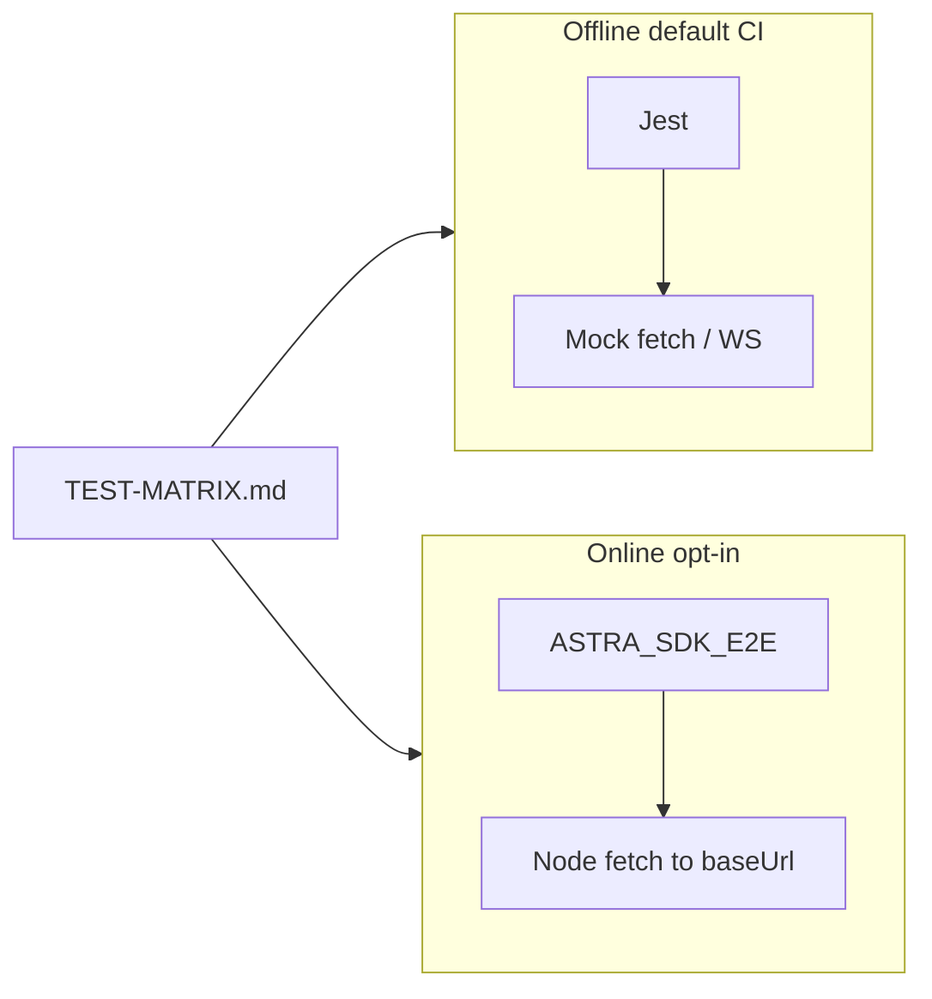

# `@astra/sdk` test matrix (offline / online)

This document catalogs **what** we care to verify and **how** we verify it without conflating layers.

- **Offline** — Jest + mock `fetch` / WebSocket / jsdom. Runs in default CI (`npm run test` / `npm run test:coverage`).
- **Online** — Real `fetch` to a process (your API or the **in-Jest local harness**). **Opt-in** via `ASTRA_SDK_E2E=1`. **Mode A:** omit `ASTRA_SDK_BASE_URL` → Jest uses [`local-e2e-server.ts`](src/__tests__/integration/local-e2e-server.ts) (`npm run test:integration:local`). **Mode B:** set `ASTRA_SDK_BASE_URL` plus token or `USERNAME`+`PASSWORD`, optionally `ASTRA_SDK_PATH_PREFIX` and `ASTRA_SDK_TEST_RUN_ID` (`npm run test:integration:remote`). See [TESTING.md](./TESTING.md#online-smoke-optional).

**Not the same as** repo root `make test-online`, which runs Rust `#[ignore]` integration tests (MatrixOne, etc.). SDK online only needs a reachable HTTP base URL.

---

## A. Modules and transports

| Area | What is under test | Offline | Online |
|------|-------------------|---------|--------|
| `paths`, `buildQueryString`, `joinApiPath` | URL helpers and encoding | `paths.test.ts` | Optional: hit any API route and assert path shape via real 404/200 (low value; usually skip) |
| `readHttpErrorMessage` | Non-OK response message extraction | `read-http-error.test.ts` | Same behavior with real 4xx/5xx body (optional smoke) |
| `AstraClient.fetch` / `post` / `put` | JSON APIs, 401 refresh, errors | `client.test.ts`, scenarios | `getMe()` with token (see [C](#c-http--failure-modes)) |
| `getRunEvents` | Buffered SSE → `StreamEvent[]`, `last_index`, 401 + second `fetch` | `client.test.ts`, `real-world-scenarios.test.ts` | Full run replay against a server that exposes the route (manual or staging) |
| `streamChat` + `SSEClient` | Streaming SSE, `chatRequestToWire`, abort | `client-edge-stream.test.ts`, `real-world-scenarios.test.ts` | One real `/chat/stream` call (long-running; optional) |
| React hooks | `useAstraStream` polling, `turn_complete` | `hooks.test.ts` (jsdom) | E2E in app (out of scope for this package) |
| WebSocket | Connect, message handling | `websocket.test.ts` | Real WS URL (optional; not in default smoke) |

---

## B. Auth and token refresh (important distinctions)

| Code path | Uses `tryRefreshToken` on 401? | Offline | Online |
|-----------|-------------------------------|---------|--------|
| `this.fetch` / `post` / `put` (JSON) | Yes | `client.test.ts` ("auto-refresh on 401"), `real-world-scenarios` (`getSession`) | `getMe` with `ASTRA_SDK_ACCESS_TOKEN` or after login |
| `getRunEvents` (buffered run stream) | Yes — custom `fetch` + retry in [`client.ts`](../src/client.ts) | Scenario: 401 → refresh → second 200 with SSE body | Optional: same against live API when token expires (hard to force; use refresh path offline) |
| `streamChat` / `SSEClient` | **No** auto-refresh in current SDK | Do not test 401 refresh on stream; document only | N/A until product adds it |

---

## C. HTTP / failure modes

| Case | Offline | Online |
|------|---------|--------|
| 2xx + JSON | Mocked in `client.test.ts` | `getMe` / health |
| 4xx / 5xx + body | `AstraApiError`, `readHttpErrorMessage` | Real 401 without token (if applicable) |
| `pathPrefix` + `baseUrl` | `client.test.ts`, `client-edge-stream.test.ts` | Set `ASTRA_SDK_BASE_URL` to gateway root; health is still `${baseUrl}/health` (see below) |
| Custom `config.headers` | `client.test.ts` | Pass-through on real calls |
| SSE: ordering, `turn_complete` + `error` | `real-world-scenarios.test.ts` | Optional stream |
| Non-OK buffered stream | `getRunEvents` 503 in scenarios | — |

**Health check URL:** the runtime serves `GET /health` at the **server root** (not necessarily under `pathPrefix`). Online smoke uses `new URL("health", baseUrlWithSlash)` or strips a trailing slash from `baseUrl` and appends `"/health"`. It does not use `AstraClient.apiPath`, which may add `pathPrefix`.

---

## D. `AstraClient` surface (checklist vs tests)

The authoritative method list is in [TESTING.md](./TESTING.md#astra-client-method-checklist). Coverage strategy:

- **Per-method unit tests** — Most thin wrappers are in [`src/__tests__/client.test.ts`](src/__tests__/client.test.ts) (mock `fetch`).
- **Scenarios** — Long chains in [`src/__tests__/scenarios/real-world-scenarios.test.ts`](src/__tests__/scenarios/real-world-scenarios.test.ts).
- **Intentional gaps** — Full E2E of every method against production is not in default CI; online smoke is **health + optional `getMe`**.

| Group | Offline coverage | Online |
|-------|------------------|--------|
| Auth | `client.test.ts`, scenarios | login env vars or bearer token |
| Sessions / runs / memory / skills / events / edge | `client.test.ts`, `client-edge-stream.test.ts` | API-dependent; not in default smoke |
| `streamChat` / `getRunEvents` | Mock streams | Optional manual |

---

## E. SSE fixtures (P1)

Sample SSE payloads live under [`src/__tests__/__fixtures__/sse/`](./src/__tests__/__fixtures__/sse/) for stable strings shared by scenarios and `parseSseDataEvents` checks.

---

## F. Mermaid: dual-track flow

